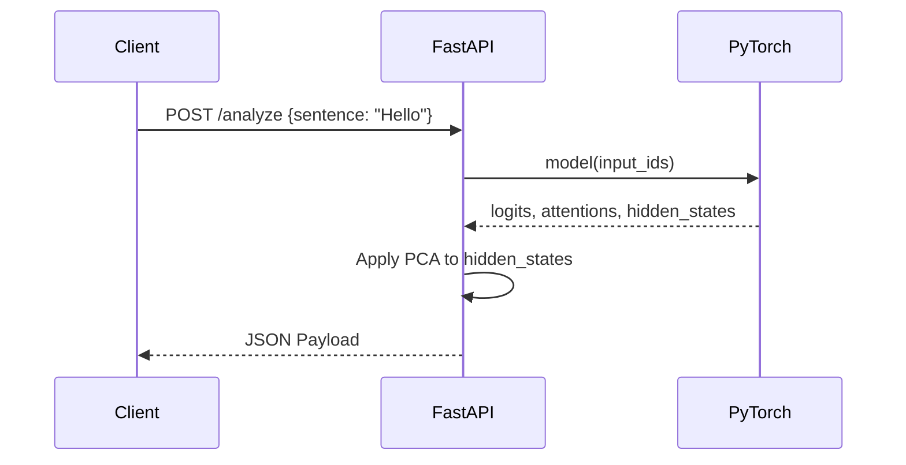

# REST API

## Overview

The REST API provides synchronous access to the PyTorch backend, handling static introspection and full single-pass analysis.

## Endpoints

### `GET /health`
Returns liveness and whether the model weights are currently loaded into memory.
```json
{ "status": "ok", "model_loaded": true }
```

### `GET /architecture`
Extracts the model's structure via `named_parameters()` without running a forward pass.
**Returns:** Architecture metadata (layers, hidden size, vocab) and a flat list of all tensors (name, shape, dtype, param count).

### `POST /analyze`
Runs a single forward pass on a provided sentence. Used primarily for Walkthrough mode.
**Body:** `{ "sentence": "The cat sat" }`
**Returns:**
- `tokens`: The tokenized IDs.
- `attention`: The full 4D attention matrix `[layer][head][from][to]` (sub-0.01 values are zeroed to save bandwidth).
- `hidden_states_3d`: The hidden states at each layer, projected to 3D via PCA.

### `GET /debug/ops`
Returns the static `op_catalog` for the loaded model, mapping operations to physical layer indices. Useful for setting programmatic breakpoints.

### `POST /ablate/analyze`
Intervention endpoint. Zeroes out specified heads or layers using PyTorch forward hooks, runs a forward pass, and returns the modified `analyze` payload to allow before/after diffing of the Logit Lens.

## Diagram



## Related pages
- [WebSocket Events](API-Reference-WebSocket-Events)
- [Data Models](API-Reference-Data-Models)

## Further reading
- [API Documentation](../docs/api.md)

## Navigation
| Previous | Home | Next |
| --- | --- | --- |
| [API Reference](API-Reference) | [Home](Home) | [WebSocket Events](API-Reference-WebSocket-Events) |
