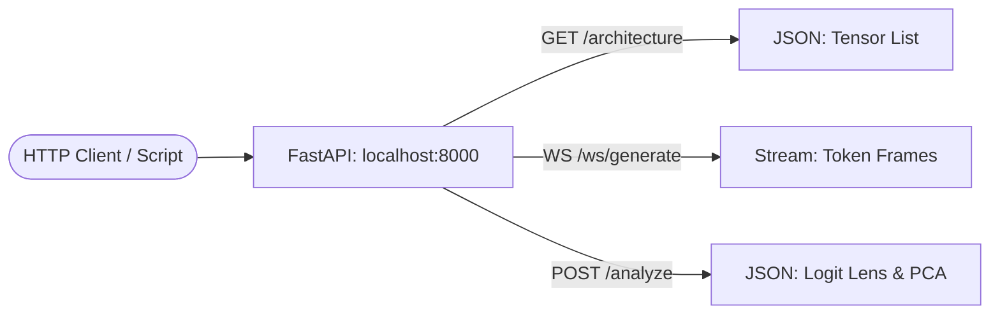

# API Reference

## Overview

TokenPrint uses a clean, documented JSON API for all communication between the frontend and the PyTorch backend. The backend is completely headless and can be used independently of the UI.

## Why it matters

If you want to build your own visualizer, write a script to automate tensor analysis, or integrate TokenPrint's data pipeline into a Jupyter Notebook, you can query these APIs directly.

## How TokenPrint implements it

The API is served via FastAPI on `http://localhost:8000`.

- **[REST API](API-Reference-REST-API):** Synchronous endpoints for fetching static data like model architecture, health status, and full forward-pass traces.
- **[WebSocket Events](API-Reference-WebSocket-Events):** The asynchronous streaming protocol used for Live Inference.
- **[Data Models](API-Reference-Data-Models):** The strict JSON schemas (defined by Pydantic) ensuring consistent types.
- **[Tensor Format](API-Reference-Tensor-Format):** How multidimensional PyTorch tensors are serialized into flat JSON arrays for web consumption.

## Diagram

## Related pages
- [Architecture](Architecture)
- [Developer Guide](Developer-Guide)

## Further reading
- [API Documentation](../docs/api.md)

## Navigation
| Previous | Home | Next |
| --- | --- | --- |
| [Performance Tips](Developer-Guide-Performance-Tips) | [Home](Home) | [REST API](API-Reference-REST-API) |
