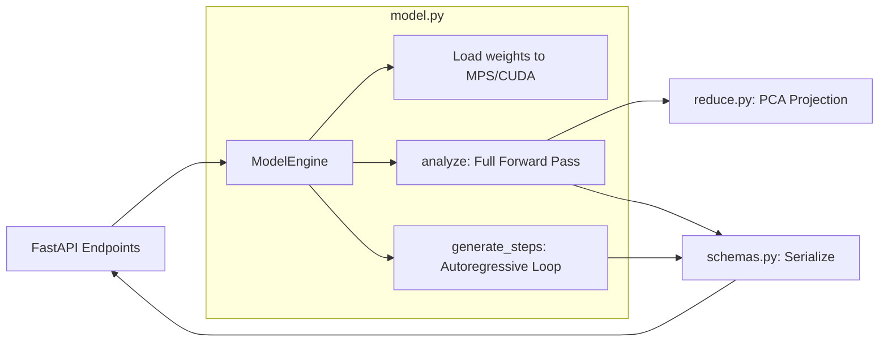

# Backend

## Overview

The TokenPrint Backend is a Python API powered by FastAPI and PyTorch. It handles the heavy lifting of loading gigabytes of weights into memory and executing real mathematical forward passes.

## Why it matters

The frontend cannot run a 0.5B parameter PyTorch model natively in the browser at acceptable speeds. The backend acts as an orchestration layer, translating complex PyTorch execution graphs into clean, structured JSON APIs.

## How TokenPrint implements it

The `backend/app/` directory contains several focused modules:

- **`main.py`**: The FastAPI application and route definitions.
- **`model.py`**: The core `ModelEngine` class. It manages the PyTorch model lifespan, extracting the `op_catalog`, and running the greedy decode loop.
- **`schemas.py`**: Pydantic models defining the exact JSON structures for requests and responses.
- **`reduce.py`**: Contains the PCA (Principal Component Analysis) logic for projecting 896-dimensional hidden states down to 3D for visualization.
- **`debug.py` & `ablation.py`**: Advanced endpoints for zeroing out specific heads/layers using PyTorch Forward Hooks.

### Memory Management
The backend loads the model exactly once during the FastAPI startup lifespan event. Subsequent API calls use this shared memory instance.

## Diagram

## Related pages
- [Overall Architecture](Architecture-Overall-Architecture)
- [WebSocket Protocol](Architecture-WebSocket-Protocol)

## Further reading
- [Backend Architecture Docs](../docs/architecture.md)

## Navigation
| Previous | Home | Next |
| --- | --- | --- |
| [Frontend](Architecture-Frontend) | [Home](Home) | [WebSocket Protocol](Architecture-WebSocket-Protocol) |
