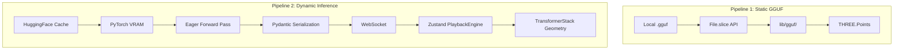

# Data Pipeline

## Overview

The Data Pipeline traces the lifecycle of a tensor from its raw bytes on a hard drive to its final geometric representation in the WebGL canvas.

## Why it matters

Understanding the pipeline helps contributors know exactly where to intercept data if they want to build new features (e.g., if you want to add a new visualization, do you intercept the data in PyTorch, in the JSON payload, or in the React component?).

## How TokenPrint implements it

There are two primary pipelines in TokenPrint:

### 1. The GGUF Pipeline (Static)
1. **Disk:** `.gguf` file resides on the user's hard drive.
2. **Browser API:** `File.slice()` reads binary chunks.
3. **Parser:** `lib/gguf/` extracts key-value metadata and the tensor inventory.
4. **Renderer:** `lib/pointcloud.ts` converts the inventory into `THREE.Points`.

### 2. The Inference Pipeline (Dynamic)
1. **Disk:** PyTorch loads HuggingFace safetensors into VRAM (MPS/CUDA).
2. **Inference:** `model.py` executes a forward pass, explicitly capturing attention states via `attn_implementation="eager"`.
3. **Serialization:** `schemas.py` converts complex PyTorch tensors into Python dictionaries, rounding floats to save bandwidth.
4. **Transport:** FastAPI sends the dict as a JSON string over WebSockets.
5. **Deserialization:** `store.ts` parses the JSON and queues it for the `PlaybackEngine`.
6. **Renderer:** The `TransformerStack` components read the queued data and update Material properties.

## Diagram

## Related pages
- [WebSocket Protocol](Architecture-WebSocket-Protocol)
- [Renderer](Architecture-Renderer)

## Further reading
- [Architecture Docs](../docs/architecture.md)

## Navigation
| Previous | Home | Next |
| --- | --- | --- |
| [WebSocket Protocol](Architecture-WebSocket-Protocol) | [Home](Home) | [Renderer](Architecture-Renderer) |
