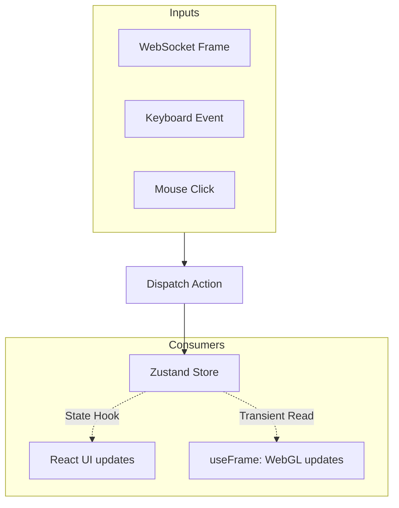

# Event System

## Overview

The Event System manages how user inputs (clicks, keypresses) and network events (WebSocket messages) propagate through the frontend application to update the UI.

## Why it matters

In standard React, updating state high in the component tree causes the entire application to re-render. In a 3D application, doing this 60 times a second will cause massive stuttering. The Event System decouples state updates from React renders wherever possible.

## How TokenPrint implements it

TokenPrint utilizes **Zustand** (`lib/store.ts`) as a centralized event bus and state manager.

### Transient State (No React Renders)
State that updates constantly (like `activeOp` during Live Inference playback) is stored in Zustand. R3F components use the `useStore.getState()` pattern inside their `useFrame` loops to read this data *without* triggering a React render. 

### Reactive State (Triggers React Renders)
State that dictates the UI layout (like `appMode` or `sidebarOpen`) is hooked into React components normally via `useStore(state => state.appMode)`.

### Event Listeners
Keyboard shortcuts (handled in `lib/useKeyboard.ts`) bypass React entirely, listening directly on the `window` object and dispatching actions straight to the Zustand store.

## Diagram

## Related pages
- [Frontend](Architecture-Frontend)
- [Animation System](Visualization-System-Animation-System)

## Further reading
- [Frontend Code: store.ts](https://github.com/Sudharsanselvaraj/Token-Print/blob/main/frontend/lib/store.ts)

## Navigation
| Previous | Home | Next |
| --- | --- | --- |
| [Renderer](Architecture-Renderer) | [Home](Home) | [Developer Guide](Developer-Guide) |
