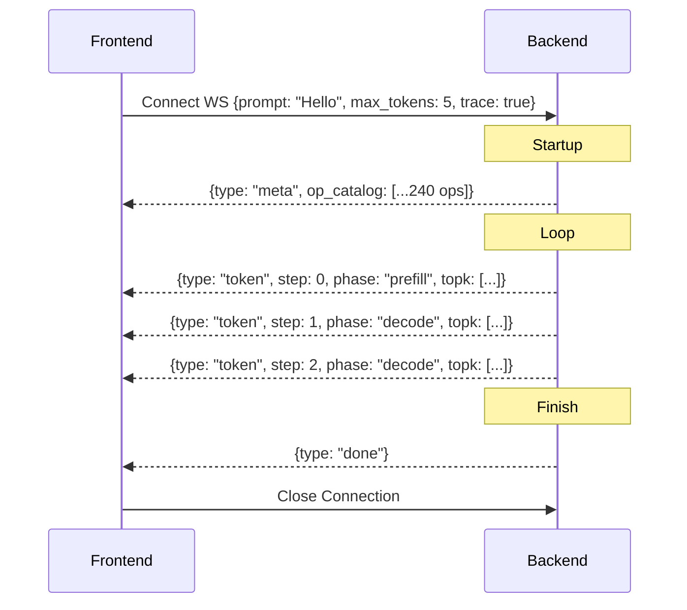

# WebSocket Protocol

## Overview

The WebSocket Protocol defines the communication stream used during Live Inference. It streams a real greedy generation from the backend to the frontend token-by-token.

## Why it matters

REST APIs are synchronous and block until the entire generation is finished. For a visual debugger, we need to see the generation happen in real-time. WebSockets allow the backend to push data to the frontend the exact millisecond a token is computed.

## How TokenPrint implements it

The endpoint is `WS /ws/generate`. 
TokenPrint utilizes a highly optimized JSON framing protocol over this socket.

1. **Meta Frame (Sent Once):** Contains model metadata and the massive `op_catalog` (a list of all 240+ operations in the forward pass). 
2. **Token Frames (Sent N times):** Contains the newly generated token, the `topk` array, the KV cache `phase`, and a small `layer_stats` array. 
3. **Done Frame:** Signals the end of generation.

**Optimization:** By sending the `op_catalog` only once, the subsequent Token frames remain tiny (a few kilobytes). The frontend references the operations by their index, avoiding massive JSON payloads and maintaining 60fps.

## Diagram

## Related pages
- [Live Inference](User-Guide-Live-Inference)
- [Backend](Architecture-Backend)

## Further reading
- [API Reference - WebSocket Events](API-Reference-WebSocket-Events)

## Navigation
| Previous | Home | Next |
| --- | --- | --- |
| [Backend](Architecture-Backend) | [Home](Home) | [Data Pipeline](Architecture-Data-Pipeline) |
