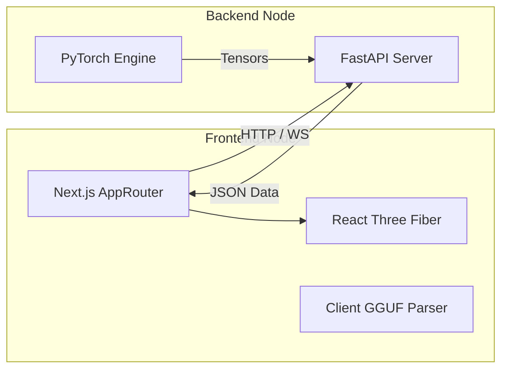

# Architecture

## Overview

TokenPrint is split cleanly into three separate concerns: **Parsing**, **Inference**, and **Rendering**. The architecture is heavily decoupled to ensure the frontend never fabricates numbers and the backend never concerns itself with pixels.

## Why it matters

Tight coupling between visualization code and machine learning code leads to unmaintainable systems. By strictly enforcing a client-server boundary via REST and WebSockets, TokenPrint allows engineers to modify the PyTorch inference engine without touching React, and vice versa.

## How TokenPrint implements it

- **[Frontend](Architecture-Frontend):** A Next.js and React Three Fiber application responsible purely for state management and rendering.
- **[Backend](Architecture-Backend):** A FastAPI and PyTorch application responsible purely for loading weights and executing forward passes.
- **[WebSocket Protocol](Architecture-WebSocket-Protocol):** The strict JSON schema that streams generation frames from backend to frontend.
- **[Data Pipeline](Architecture-Data-Pipeline):** The flow of tensors from disk to memory to WebSocket.
- **[Renderer](Architecture-Renderer):** The WebGL engine translating math to geometry.
- **[Event System](Architecture-Event-System):** The Zustand store managing state without triggering unnecessary React renders.

## Diagram

## Related pages
- [Overall Architecture](Architecture-Overall-Architecture)
- [Developer Guide](Developer-Guide)

## Further reading
- [Architecture Documentation](../docs/architecture.md)

## Navigation
| Previous | Home | Next |
| --- | --- | --- |
| [Interaction Model](Visualization-System-Interaction-Model) | [Home](Home) | [Overall Architecture](Architecture-Overall-Architecture) |
