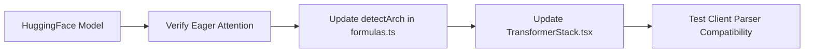

# Adding a New Model

## Overview

TokenPrint currently defaults to Qwen2.5. This guide explains how to add explicit support for a new model architecture (e.g., DeepSeek) to the platform.

## Why it matters

Because TokenPrint is architecture-aware, simply changing the `MODEL_NAME` string in the backend might result in incorrect visuals if the frontend doesn't know how to render the new model's specific quirks (like new normalization layers or attention variants).

## How TokenPrint implements it

### 1. Update the Backend (`model.py`)
Ensure the `ModelEngine` can load the model via `transformers`.
Crucially, verify that `attn_implementation="eager"` actually returns the attention tensors. Some custom model implementations on HuggingFace require patches to expose intermediate variables.

### 2. Update the Architecture Detector (`formulas.ts`)
In the frontend, locate `detectArch()` in `lib/formulas.ts`.
Add a condition to check for the new architecture string (e.g., `config.architecture === 'deepseek'`).
Define the LaTeX formula set for this architecture.

### 3. Update the Geometry (`TransformerStack.tsx`)
If the model uses a standard block (like Llama), no changes are needed.
If the model uses a novel block (like Phi-2's parallel structure), you must create a new branch in `TransformerStack.tsx` that alters the 3D layout when that architecture is detected.

### 4. Test GGUF Compatibility
Download a quantized version of the model. Drag it into the frontend and verify the client-side parser in `lib/gguf/` correctly reads the header and maps the tensors.

## Diagram

## Related pages
- [Supported Models](Supported-Models)
- [Architecture](Architecture)

## Further reading
- [Contributing Ideas](../docs/contributing-ideas.md)

## Navigation
| Previous | Home | Next |
| --- | --- | --- |
| [Adding a New Visualization](Developer-Guide-Adding-a-New-Visualization) | [Home](Home) | [Creating UI Components](Developer-Guide-Creating-UI-Components) |
