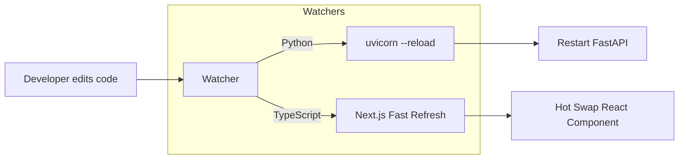

# Building From Source

## Overview

To contribute to TokenPrint, you need to run the application in development mode on your local machine.

## Why it matters

Development mode enables hot-reloading for the frontend and auto-reloading for the backend, allowing you to see your code changes instantly without restarting the servers manually.

## How TokenPrint implements it

### 1. Backend (FastAPI + PyTorch)

```bash
cd backend
python3 -m venv .venv --system-site-packages
source .venv/bin/activate
pip install -r requirements.txt
```

To run with auto-reload:
```bash
python -m uvicorn app.main:app --app-dir . --port 8000 --reload
```
*Note: The `--reload` flag is great for API development, but because loading the model into VRAM takes 5-10 seconds, it can be annoying if you are only editing non-model code.*

### 2. Frontend (Next.js + R3F)

```bash
cd frontend
npm install
```

To run with hot-reloading:
```bash
npm run dev
```

The frontend will be available at `http://localhost:3000`. Next.js Fast Refresh will automatically update the browser when you save a file in `components/` or `lib/`.

> **Warning**
> If you edit Zustand state inside `store.ts`, you may occasionally need to manually refresh the browser to prevent state desync between the React DOM and the R3F Canvas.

## Diagram



## Related pages
- [Code Style](Developer-Guide-Code-Style)
- [Repository Structure](Developer-Guide-Repository-Structure)

## Further reading
- [Deployment Docs](../docs/deployment.md)

## Navigation
| Previous | Home | Next |
| --- | --- | --- |
| [Repository Structure](Developer-Guide-Repository-Structure) | [Home](Home) | [Code Style](Developer-Guide-Code-Style) |
