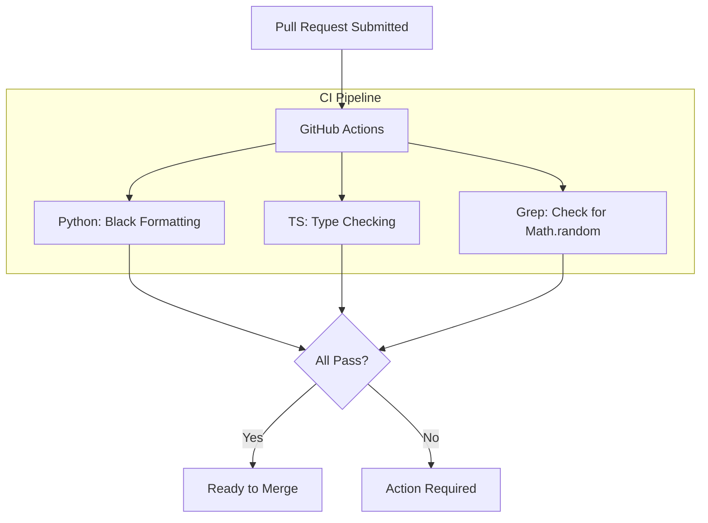

# Code Style

## Overview

TokenPrint enforces strict coding standards to maintain readability and scientific honesty across a complex, multi-language codebase.

## Why it matters

In an educational tool, the code itself should be educational. Messy, undocumented code undermines the project's goal of demystifying AI. Furthermore, strict rules (like banning `Math.random()`) are mechanically enforced to prove the visualization's integrity.

## How TokenPrint implements it

### 1. The "No Fabricated Numbers" Rule
The most important rule in TokenPrint: **Never fabricate data to make the UI look better.**
- The frontend build step `npm run build` literally runs a script (`verify-data.sh`) that greps for `Math.random` in the `app/`, `components/`, and `lib/` directories. 
- If you need visual jitter for a particle effect, you must add it to the explicit allowlist in the build script and justify it in your PR.

### 2. Python Backend
- **Formatting:** Use `black` and `isort`.
- **Typing:** Use strict Python type hints. Pydantic schemas (`schemas.py`) must be used for all JSON serialization.
- **Documentation:** Use Google-style docstrings for complex tensor manipulations in `model.py`.

### 3. TypeScript Frontend
- **Formatting:** Use `prettier`.
- **Typing:** Strict TypeScript is enforced. Do not use `any`. Define interfaces for all API responses.
- **Components:** Prefer functional components. 
- **Colors:** Never hardcode HEX or RGB values in React components. Always import from `lib/sceneColors.ts`.

## Diagram

## Related pages
- [Contributing](Contributing)
- [Repository Structure](Developer-Guide-Repository-Structure)

## Further reading
- [Verification Docs](../docs/verification.md)

## Navigation
| Previous | Home | Next |
| --- | --- | --- |
| [Building From Source](Developer-Guide-Building-From-Source) | [Home](Home) | [Adding a New Visualization](Developer-Guide-Adding-a-New-Visualization) |
