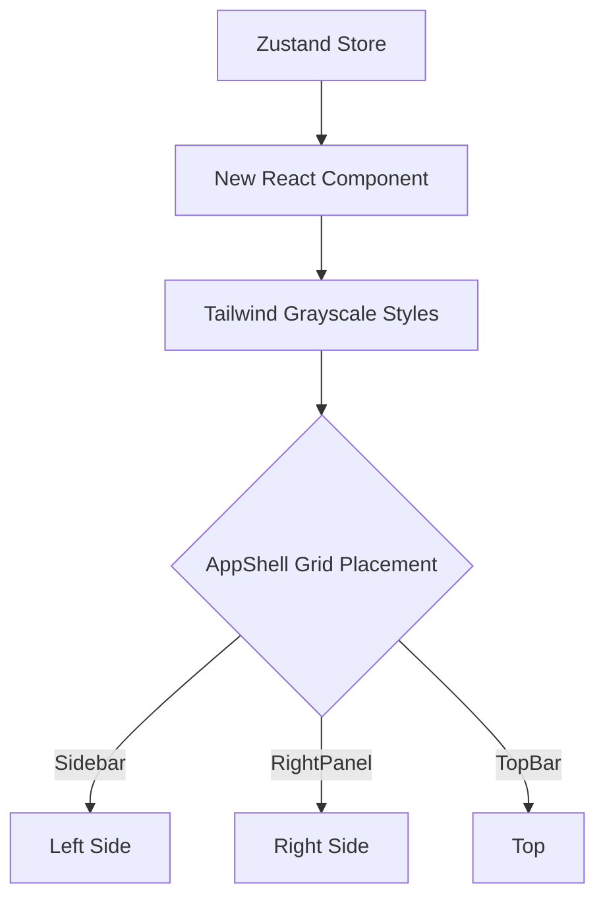

# Creating UI Components

## Overview

The TokenPrint UI (everything outside the 3D canvas) is built using React and Tailwind CSS. This guide covers how to add new panels, buttons, or HUD elements.

## Why it matters

The AppShell uses a strict CSS Grid. If you add a floating `div` with absolute positioning arbitrarily, it may overlap the 3D canvas in ways that break the user experience across different screen sizes.

## How TokenPrint implements it

### The Grid System
The `AppShell` defines explicit areas: `top`, `side`, `canvas`, `right`, and `bot`.

### To Add a New Panel:
1. Determine which grid area it belongs in (e.g., Developer tools go in the `RightPanel` or `Sidebar`).
2. Create the component in `frontend/components/ui/`.
3. Use Tailwind for styling. Stick to grayscale colors (`bg-gray-800`, `text-gray-200`) to avoid clashing with the 3D scene's data-driven colors.
4. If the panel needs to read data from the 3D scene (like the hovered tensor), use Zustand (`useStore(state => state.hoveredTensor)`). Do not pass props down through the AppShell.

### Example: Adding a "Clear Cache" Button
```tsx
import { useStore } from '@/lib/store';

export function ClearCacheButton() {
  const clearCache = useStore(state => state.clearCache);
  
  return (
    <button 
      className="px-2 py-1 bg-gray-700 hover:bg-gray-600 rounded text-xs text-white"
      onClick={clearCache}
    >
      Clear Cache
    </button>
  );
}
```

## Diagram



## Related pages
- [HUD](User-Guide-HUD)
- [Code Style](Developer-Guide-Code-Style)

## Further reading
- [Frontend Architecture](../docs/architecture.md)

## Navigation
| Previous | Home | Next |
| --- | --- | --- |
| [Adding a New Model](Developer-Guide-Adding-a-New-Model) | [Home](Home) | [Debugging](Developer-Guide-Debugging) |
