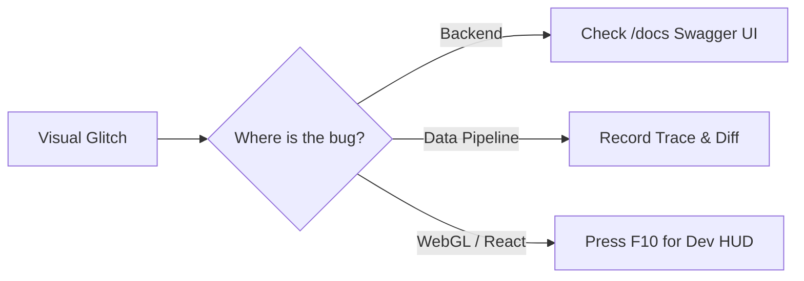

# Debugging

## Overview

Because TokenPrint is itself a visual debugger for AI models, debugging TokenPrint usually involves using its own tools to verify that data is flowing correctly.

## Why it matters

If the 3D scene breaks, it could be a WebGL issue, a React state issue, a JSON serialization bug, or a PyTorch runtime error. Knowing how to isolate the problem saves hours of frustration.

## How TokenPrint implements it

### 1. Backend Debugging
- Use the Swagger UI automatically generated by FastAPI at `http://localhost:8000/docs`. You can trigger `POST /analyze` manually and inspect the raw JSON response to verify attention tensors are being extracted correctly.
- Run the verification scripts in `backend/scripts/` (e.g., `verify_real_data.py`) to confirm the PyTorch engine is healthy without the API layer.

### 2. Frontend Debugging
- Press `F10` in the TokenPrint UI to toggle **Developer Mode**. This exposes raw numerical readouts and LOD (Level of Detail) toggles in the HUD.
- Open the Chrome DevTools Console. The Zustand store logs major state transitions.
- Use the **Debugger Pane** (available in the Sidebar when Dev Mode is active). It includes a Flame Graph of the `op_catalog` and anomaly sentinels to track memory spikes.

### 3. Tracing
If a generation run looks visually corrupted, enable `record_trace: true` in the API request. Download the `.tokenprint.json` trace file and run `scripts/trace_diff.py` against a known-good trace to pinpoint exactly which tensor deviated.

## Diagram

## Related pages
- [Architecture](Architecture)
- [Performance Tips](Developer-Guide-Performance-Tips)

## Further reading
- [Verification Documentation](../docs/verification.md)

## Navigation
| Previous | Home | Next |
| --- | --- | --- |
| [Creating UI Components](Developer-Guide-Creating-UI-Components) | [Home](Home) | [Performance Tips](Developer-Guide-Performance-Tips) |
