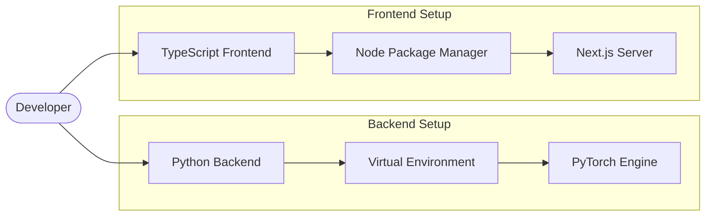

# Developer Guide

## Overview

Welcome to the TokenPrint Developer Guide. This section is intended for engineers, researchers, and open-source contributors who want to modify the source code, add new features, or fix bugs.

## Why it matters

TokenPrint is a complex application spanning multiple languages (Python, TypeScript) and paradigms (REST, WebSockets, React, WebGL). Without a clear map of how the codebase is structured and how to compile it, contributing can be daunting.

## How TokenPrint implements it

The repository is strictly divided into two root folders: `backend/` and `frontend/`. They do not share dependencies, build systems, or languages.

Before you write any code, we highly recommend reading the [Architecture](Architecture) and [Visual Mapping](../docs/visual-mapping.md) documentation to understand the project's core philosophy: **Never fabricate data.**

## Section Contents

- **[Repository Structure](Developer-Guide-Repository-Structure):** Where files live.
- **[Building From Source](Developer-Guide-Building-From-Source):** How to compile and run in dev mode.
- **[Code Style](Developer-Guide-Code-Style):** Linters, formatters, and architectural rules.
- **[Adding a New Visualization](Developer-Guide-Adding-a-New-Visualization):** How to tie new 3D geometry to tensor data.
- **[Adding a New Model](Developer-Guide-Adding-a-New-Model):** How to support new architectures like DeepSeek.
- **[Creating UI Components](Developer-Guide-Creating-UI-Components):** How to add buttons and panels to the AppShell.
- **[Debugging](Developer-Guide-Debugging):** How to use TokenPrint's own debug tools on itself.
- **[Performance Tips](Developer-Guide-Performance-Tips):** How to keep WebGL running at 60fps.

## Diagram

## Related pages
- [Contributing](Contributing)
- [Architecture](Architecture)

## Further reading
- [Project README](../README.md)

## Navigation
| Previous | Home | Next |
| --- | --- | --- |
| [Event System](Architecture-Event-System) | [Home](Home) | [Repository Structure](Developer-Guide-Repository-Structure) |
