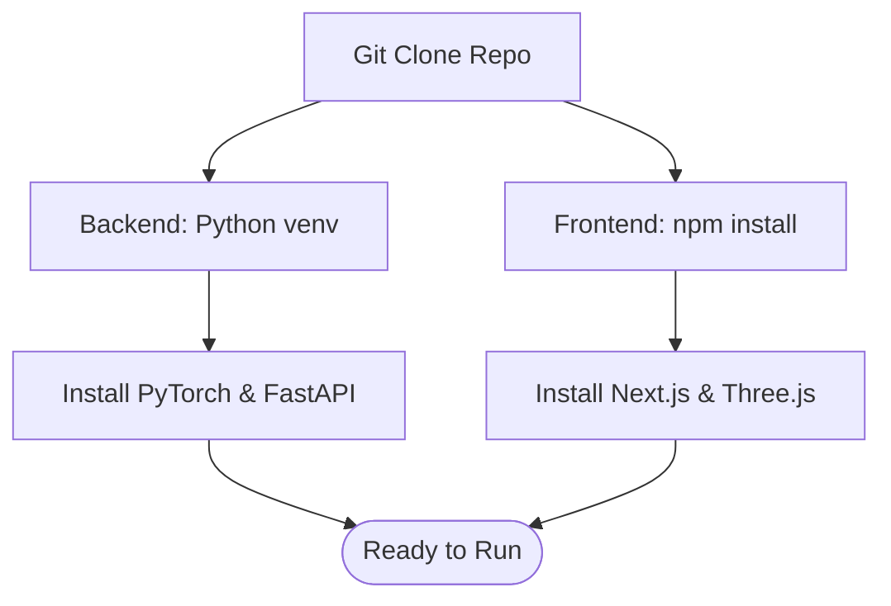

# Installation

## Overview

Installation covers setting up both the Python backend and the Node.js frontend. TokenPrint runs entirely locally to guarantee privacy and fast rendering of massive tensor arrays.

## Why it matters

TokenPrint relies on real mathematical operations, requiring specific package versions (like PyTorch) to accurately extract intermediate activations and attentions. A mismatched environment might result in silent fallbacks or missing tensor data that compromises the scientific accuracy of the visualization.

## How TokenPrint implements it

The project uses standard, modern package management:
- **Backend:** Python virtual environments (`venv`) and `requirements.txt`.
- **Frontend:** Node.js with `npm`.

## Step-by-Step Installation

### Prerequisites
- Python 3.10+
- Node.js 18+
- Git

### 1. Clone the repository
```bash
git clone https://github.com/Sudharsanselvaraj/Token-Print.git
cd Token-Print
```

### 2. Install the Backend
The backend utilizes PyTorch and FastAPI. 

```bash
cd backend
# Create a virtual environment
python3 -m venv .venv --system-site-packages
# Activate it
source .venv/bin/activate  # On Windows use: .venv\Scripts\activate
# Install dependencies
pip install -r requirements.txt
```

> **Note**
> By default, the `requirements.txt` fetches PyTorch. If you have a specific GPU (CUDA/MPS), ensure your PyTorch build matches your hardware to enable hardware acceleration. The backend works on CPU, but loading models will be slower.

### 3. Install the Frontend
The frontend uses Next.js, Three.js, and React Three Fiber.

```bash
cd ../frontend
# Install dependencies
npm install
```

## Diagram



## Related pages
- [Getting Started](Getting-Started)
- [Quick Start](Getting-Started-Quick-Start)

## Further reading
- [Project README](../README.md)
- [Development Environment Setup](../docs/development.md)

## Navigation
| Previous | Home | Next |
| --- | --- | --- |
| [Getting Started](Getting-Started) | [Home](Home) | [Quick Start](Getting-Started-Quick-Start) |
