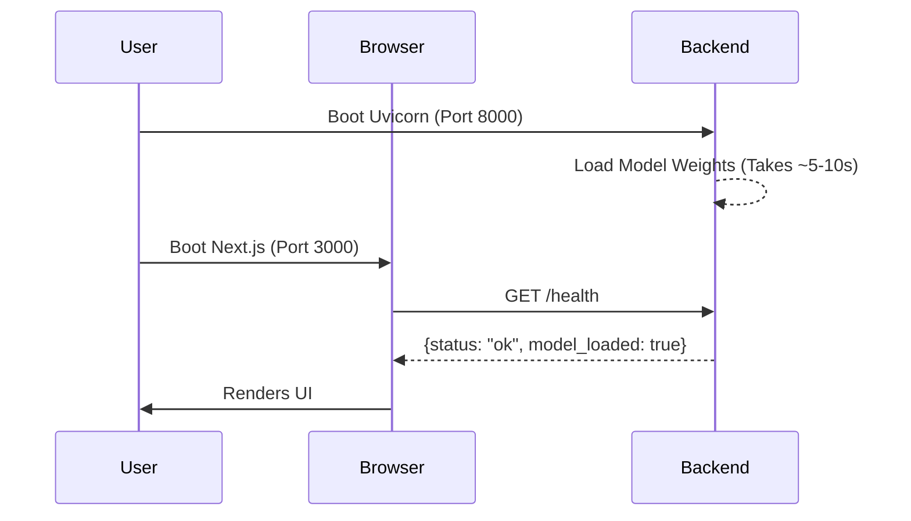

# Quick Start

## Overview

Once TokenPrint is installed, you need to boot both the frontend and backend servers to start using the application. This guide walks you through starting the servers and verifying their health.

## Why it matters

The frontend UI requires the backend API to fetch architecture metadata and to stream inference traces. If they aren't booted correctly, or are running on the wrong ports, the application will display connection errors.

## How TokenPrint implements it

TokenPrint defaults to local development ports:
- **Backend:** `http://localhost:8000` (uvicorn)
- **Frontend:** `http://localhost:3000` (next dev)

The frontend makes CORS-restricted calls directly to the backend port.

## Running the Servers

You will need two separate terminal windows.

### Terminal 1: Backend
The backend will automatically download the default Qwen model (`Qwen/Qwen2.5-0.5B-Instruct`) from HuggingFace on its first run. This requires an internet connection and will download roughly 1GB of data.

```bash
cd backend
source .venv/bin/activate
# Start the FastAPI server
python -m uvicorn app.main:app --app-dir . --port 8000
```
*Wait until you see `Application startup complete.`*

### Terminal 2: Frontend
```bash
cd frontend
# Start the Next.js development server
npm run dev
```

### Verifying the Setup

Open your web browser and navigate to:
**[http://localhost:3000](http://localhost:3000)**

You should see the TokenPrint UI. Look at the Top Bar; it should display the model status as **"Ready"** and indicate the active device (e.g., `mps`, `cuda`, or `cpu`).

> **Warning**
> If the UI shows a "Disconnected" error, verify that the backend is running on exactly port `8000` and that your browser is allowing local CORS requests.

## Diagram



## Related pages
- [Installation](Getting-Started-Installation)
- [Running your first visualization](Getting-Started-Running-your-first-visualization)

## Further reading
- [API Reference](API-Reference)
- [Deployment Docs](../docs/deployment.md)

## Navigation
| Previous | Home | Next |
| --- | --- | --- |
| [Installation](Getting-Started-Installation) | [Home](Home) | [Running your first visualization](Getting-Started-Running-your-first-visualization) |
