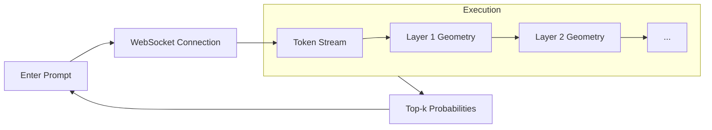

# Running your first visualization

## Overview

With both servers running, it's time to actually visualize a Transformer Layer. This guide will walk you through interacting with the Architecture Explorer and running a Live Inference trace.

## Why it matters

Understanding how to trigger visualizations and read the resulting 3D geometry is the core skill required to use TokenPrint effectively. The interface is highly interactive and relies on your input to fetch data.

## How TokenPrint implements it

TokenPrint utilizes different visualization "Modes" available in the Top Bar. Switching modes unmounts the current 3D scene and mounts a new one, fetching entirely new datasets from the backend.

## 1. The Architecture Explorer

By default, TokenPrint opens in **Architecture** mode. 

1. On the left Sidebar, you will see a **Model Loader**. Click **"Use live Qwen model"**.
2. The UI will send a `GET /architecture` request to the backend.
3. The 3D Canvas will populate with a massive point cloud. Each point represents a real tensor in the loaded model.
4. **Hover** over any point with your mouse to see its name, shape, and parameter count in a tooltip.
5. Notice the layers are colored by depth, creating a visual map of the model's structure.

## 2. Inspecting a GGUF File

TokenPrint can also inspect models without the backend via client-side parsing.

1. Download any small `.gguf` file (e.g., a quantized Llama 3 model from HuggingFace).
2. Drag and drop the `.gguf` file directly onto the TokenPrint browser window.
3. The client-side parser will instantly read the header, skipping the heavy weights, and render a new Architecture point cloud. 

> **Note**
> The `.gguf` file never leaves your browser. Parsing happens locally and instantly.

## 3. Live Inference

Let's watch the model think in real-time.

1. Click the **Generation** tab in the Top Bar.
2. In the bottom HUD, locate the prompt input box.
3. Type a simple prompt, such as: `Name one primary color.`
4. Press **Enter** or click **Generate**.
5. TokenPrint will open a WebSocket stream (`WS /ws/generate`) with `trace: true`.
6. Watch as the 3D scene constructs a Transformer Stack. 
7. The camera will follow the execution layer-by-layer. You will see Attention blades, the SwiGLU funnel, and LayerNorm waists light up as data passes through them.
8. At the top of the stack, watch the **Top-k Skyline** render the actual probability distributions for the next token.

## Diagram

## Related pages
- [User Guide](User-Guide)
- [Architecture Explorer](User-Guide-Architecture-Explorer)
- [Live Inference](User-Guide-Live-Inference)

## Further reading
- [Visual Mapping Docs](../docs/visual-mapping.md)

## Navigation
| Previous | Home | Next |
| --- | --- | --- |
| [Quick Start](Getting-Started-Quick-Start) | [Home](Home) | [User Guide](User-Guide) |
