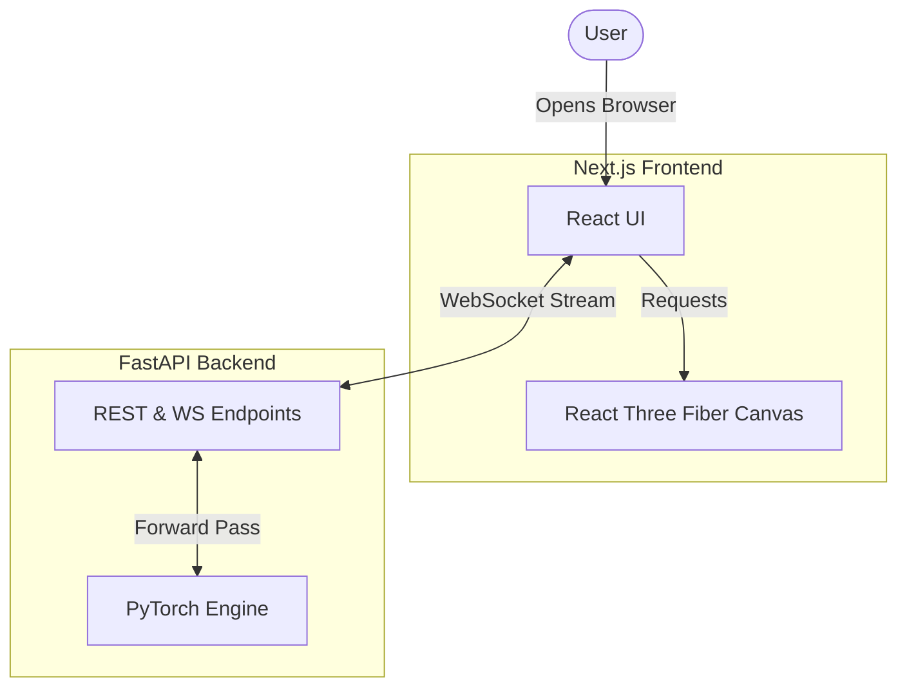

# Getting Started

## Overview

Welcome to TokenPrint! This section provides everything you need to get the platform running locally on your machine and to execute your very first live generation. 

## Why it matters

Because TokenPrint connects to a real PyTorch backend and renders highly complex 3D scenes in the browser, having a correctly configured environment is crucial. A flawless setup ensures that what you see on the screen exactly matches the raw tensor data generated during the forward pass.

## How TokenPrint implements it

TokenPrint is split into two lightweight, decoupled services:
1. **The Backend:** A FastAPI Python application running PyTorch that loads the model into memory and executes inference.
2. **The Frontend:** A Next.js application with React Three Fiber (R3F) that connects to the backend via REST and WebSockets to render the UI.

This separation means you can run the backend on a powerful machine with a GPU while opening the frontend on a lightweight laptop browser.

## Diagram

## Section Contents

Follow these pages in order to get up and running:

- **[Installation](Getting-Started-Installation):** Step-by-step instructions for installing dependencies for both the frontend and backend.
- **[Quick Start](Getting-Started-Quick-Start):** How to boot both servers and verify they are communicating.
- **[Running your first visualization](Getting-Started-Running-your-first-visualization):** A walkthrough of executing your first live inference or loading your first GGUF file.

> **Tip**
> If you encounter issues during installation, especially relating to Python packages like PyTorch, ensure you have the appropriate CUDA or MPS tools installed for your operating system.

## Related pages
- [Home](Home)
- [User Guide](User-Guide)

## Further reading
- [Project README](../README.md)
- [Deployment Docs](../docs/deployment.md)

## Navigation
| Previous | Home | Next |
| --- | --- | --- |
| [Home](Home) | [Home](Home) | [Installation](Getting-Started-Installation) |
