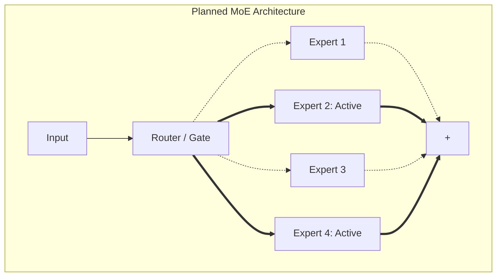

# DeepSeek

## Overview

DeepSeek models (like DeepSeek-Coder and DeepSeek-V2) introduce advanced architectural variations, particularly concerning Mixture-of-Experts (MoE) and Multi-Head Latent Attention (MLA).

## Why it matters

As models push for higher efficiency, standard dense MLPs and standard MHA are being replaced. TokenPrint's architecture-aware engine must eventually adapt to these paradigms to remain relevant for cutting-edge research.

## How TokenPrint implements it

> **Warning**
> **Current Status:** Full MoE and MLA support are on the [Roadmap](Roadmap). Currently, DeepSeek dense models are parsed as standard Llama-like architectures where applicable. 

**Planned Visual Mapping for MoE:**
Instead of a single SwiGLU funnel, TokenPrint will render a **Router** node.
The Router will calculate the probabilities for the experts.
The geometry will fan out into $N$ parallel Expert funnels, but only the active top-K experts will light up and process data during the live inference trace, making the sparsity of MoE visually explicit.

## Diagram

## Related pages
- [Supported Models](Supported-Models)
- [Roadmap](Roadmap)

## Further reading
- [Project Roadmap](../ROADMAP.md)

## Navigation
| Previous | Home | Next |
| --- | --- | --- |
| [Phi](Supported-Models-Phi) | [Home](Home) | [Visualization System](Visualization-System) |
