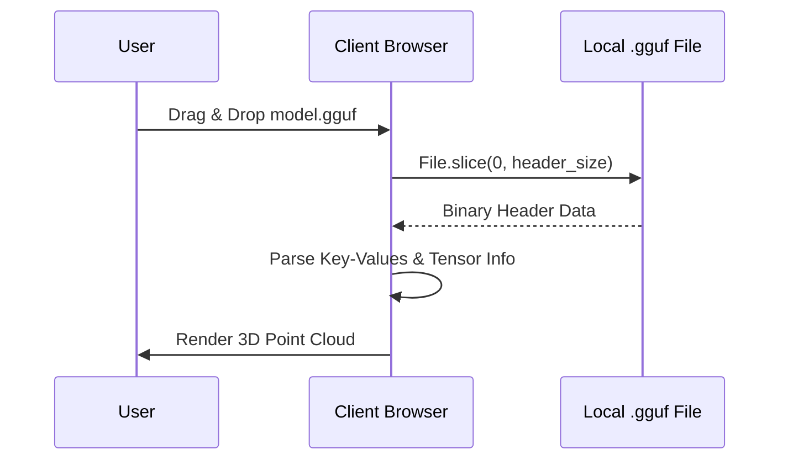

# GGUF

## Overview

GGUF (GPT-Generated Unified Format) is a binary format designed for rapid loading and saving of models, primarily popularized by `llama.cpp`.

## Why it matters

Standard PyTorch or HuggingFace checkpoints (`.bin` or `.safetensors`) often require gigabytes of RAM and complex Python environments to parse. GGUF embeds all model metadata into a highly structured header, making it perfect for rapid, client-side inspection.

## How TokenPrint implements it

TokenPrint features a **pure client-side GGUF parser** (`lib/gguf/`). 

When you drag and drop a `.gguf` file onto TokenPrint:
1. It uses the browser's `File.slice()` API.
2. It only reads the first few megabytes (the Header) where the metadata and tensor inventory are stored.
3. The gigabytes of quantized weights are ignored.
4. Parsing a 40GB model takes under 50 milliseconds and requires zero network uploads.

## Client-side Dequantization

If you want to view the actual numbers inside a tensor, TokenPrint uses a custom `dequant.ts` module. When you open the Tensor Inspector, it seeks to the exact byte offset of that tensor in the local file, reads a small chunk, and dequantizes it (e.g., converting Q4_K back to float32) to show you an 8x8 weight preview.

> **Warning**
> GGUF models are only supported for **Architecture Explorer** and **Tensor Inspector** modes. Because the backend PyTorch engine requires unquantized weights to capture exact intermediate activations (like softmax attention probabilities), TokenPrint cannot currently run Live Inference directly on a quantized GGUF file.

## Diagram

## Related pages
- [Supported Models](Supported-Models)
- [Tensor Inspector](User-Guide-Tensor-Inspector)

## Further reading
- [GGUF Format Docs](../docs/gguf-format.md)

## Navigation
| Previous | Home | Next |
| --- | --- | --- |
| [Supported Models](Supported-Models) | [Home](Home) | [HuggingFace](Supported-Models-HuggingFace) |
