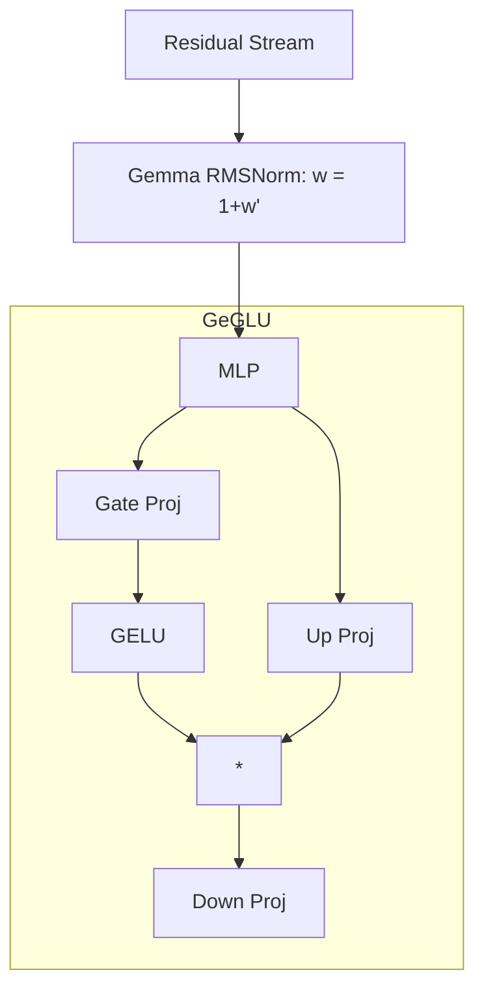

# Gemma

## Overview

Gemma is a family of lightweight, state-of-the-art open models built by Google DeepMind, based on the Gemini architecture.

## Why it matters

While structurally similar to Llama/Qwen, Gemma introduces a few distinct architectural choices that TokenPrint must account for, primarily around normalization and vocabulary size.

## How TokenPrint implements it

When TokenPrint detects `architecture: "gemma"` (or `gemma2`), it adapts to its specific quirks:

1. **RMSNorm Variants:** Gemma uses a slightly different formulation of RMSNorm where the learnable weight parameter $w$ is added to $1.0$ (i.e., $w = 1 + w\_offset$) before multiplying. TokenPrint's HUD formulas update to reflect this.
2. **GeGLU Activation:** Instead of SwiGLU, Gemma uses GeGLU (GELU gating). TokenPrint updates the HUD formulas and geometry labeling accordingly.
3. **Massive Vocabulary:** Like Qwen, Gemma features a massive 256k vocabulary. TokenPrint scales the Unembedding block proportionally.
4. **Logit Soft-Capping (Gemma 2):** Gemma 2 introduces soft-capping on logits to prevent extreme values. TokenPrint's formulas capture this when detected.

## Diagram

## Related pages
- [Supported Models](Supported-Models)
- [Feed Forward Network](Transformer-Concepts-Feed-Forward-Network)

## Further reading
- [Visual Mapping](../docs/visual-mapping.md)

## Navigation
| Previous | Home | Next |
| --- | --- | --- |
| [Qwen](Supported-Models-Qwen) | [Home](Home) | [Phi](Supported-Models-Phi) |
