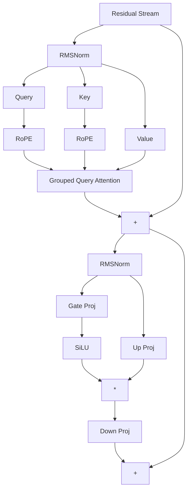

# Llama

## Overview

Llama (and its successors Llama 2 and Llama 3) by Meta established the dominant architectural paradigm for modern open-weights transformers. TokenPrint fully supports parsing and visualizing Llama-family models.

## Why it matters

Llama deviated from the original GPT-2 architecture in several critical ways. To accurately represent a Llama model, a visualizer must account for these structural changes rather than falling back to generic transformer diagrams.

## How TokenPrint implements it

When TokenPrint detects `architecture: "llama"`, it applies specific visual mappings:

1. **RMSNorm:** Replaces standard LayerNorm. The 3D scene renders the normalization waists, and the HUD displays the root-mean-square formula.
2. **RoPE (Rotary Positional Embeddings):** TokenPrint replaces additive absolute positional embeddings with RoPE, visualizing the frequency-based rotary twist applied to Queries and Keys.
3. **SwiGLU:** Replaces the standard GELU activation in the MLP. The 3D geometry renders two separate incoming prongs (the `gate_proj` and `up_proj`) that merge at an element-wise multiplication node before passing to the `down_proj`.
4. **GQA (Grouped Query Attention):** Starting with Llama 2 (and prevalent in Llama 3), models use fewer KV heads than Query heads. TokenPrint visually clusters the Query blades around their shared KV blade in the 3D stack.

## Diagram

## Related pages
- [Supported Models](Supported-Models)
- [RoPE](Transformer-Concepts-RoPE)
- [Multi-Head Attention](Transformer-Concepts-Multi-Head-Attention)

## Further reading
- [Visual Mapping](../docs/visual-mapping.md)

## Navigation
| Previous | Home | Next |
| --- | --- | --- |
| [HuggingFace](Supported-Models-HuggingFace) | [Home](Home) | [Qwen](Supported-Models-Qwen) |
