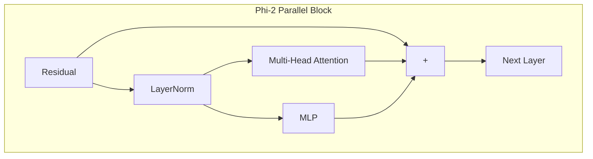

# Phi

## Overview

Phi (specifically Phi-2 and Phi-3) by Microsoft are highly efficient small language models trained on "textbook quality" data.

## Why it matters

Phi-2 breaks the standard sequential transformer mold by utilizing **Parallel Attention and MLP** layers. If a visualizer renders Phi-2 sequentially, it is rendering a lie.

## How TokenPrint implements it

### Phi-2
When TokenPrint detects Phi-2, it drastically alters the 3D `TransformerStack` geometry. 
Instead of the Residual Stream going through Attention, adding, then going through the MLP and adding again, it:
1. Passes the input into a single LayerNorm.
2. Splits the normalized output in parallel to *both* the Attention block and the MLP block.
3. Sums the outputs of both blocks together with the original residual in a single addition step.

The 3D geometry physically diverges into two parallel branches and merges at a single node.

### Phi-3
Phi-3 reverts to a more standard sequential architecture (similar to Llama) with RMSNorm, RoPE, and SwiGLU. TokenPrint detects this and reverts to the sequential block geometry while updating formulas for SuRoPE (Short/Long RoPE scaling) if present.

## Diagram

## Related pages
- [Supported Models](Supported-Models)
- [Residual Connections](Transformer-Concepts-Residual-Connections)

## Further reading
- [Architecture Docs](../docs/architecture.md)

## Navigation
| Previous | Home | Next |
| --- | --- | --- |
| [Gemma](Supported-Models-Gemma) | [Home](Home) | [DeepSeek](Supported-Models-DeepSeek) |
