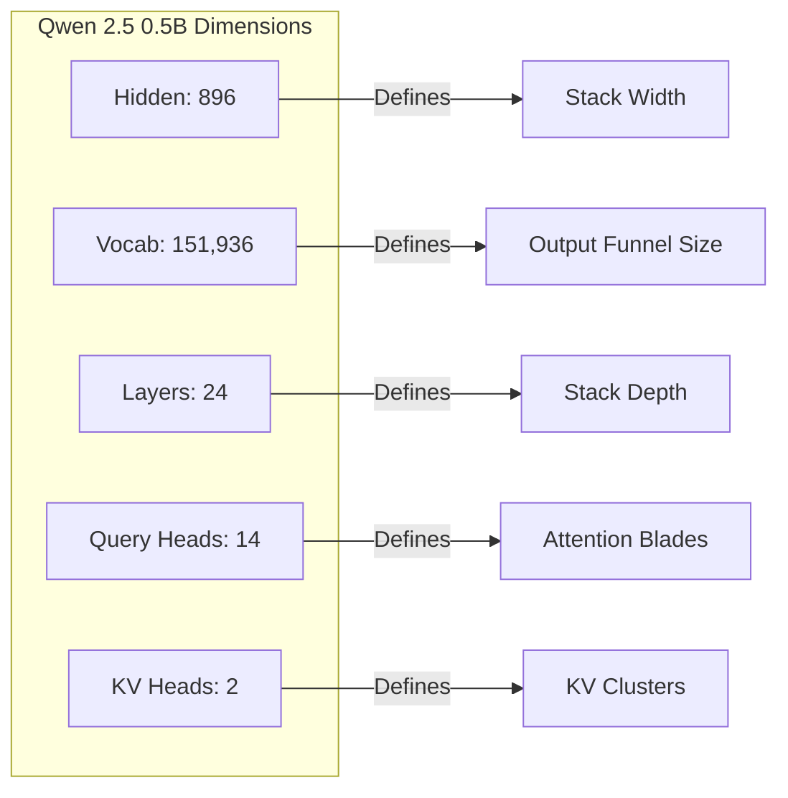

# Qwen

## Overview

Qwen (and specifically Qwen 2 and 2.5) by Alibaba Cloud is the default model family used by TokenPrint's backend. 

## Why it matters

Qwen 2.5 represents the state-of-the-art in small, highly capable models. By defaulting to `Qwen2.5-0.5B-Instruct`, TokenPrint ensures that every user can run live, unquantized PyTorch inference locally on standard hardware without running out of memory.

## How TokenPrint implements it

Architecturally, Qwen2 is very similar to Llama. It utilizes:
- RMSNorm
- RoPE
- SwiGLU
- Grouped Query Attention (GQA)

When TokenPrint detects `architecture: "qwen2"`, it applies the same geometric rules as Llama.

**Specific to Qwen 2.5 0.5B:**
- **Layers:** 24
- **Attention Heads:** 14 Query Heads, 2 KV Heads (GQA ratio of 7:1)
- **Hidden Size:** 896
- **Vocab Size:** 151,936 (Massive multilingual vocabulary)

In TokenPrint's 3D stack, you will explicitly see exactly 14 blades clustered into 2 groups, and an unusually wide Unembedding block representing the massive vocabulary.

## Diagram

## Related pages
- [Supported Models](Supported-Models)
- [Llama](Supported-Models-Llama)

## Further reading
- [Project README](../README.md)

## Navigation
| Previous | Home | Next |
| --- | --- | --- |
| [Llama](Supported-Models-Llama) | [Home](Home) | [Gemma](Supported-Models-Gemma) |
