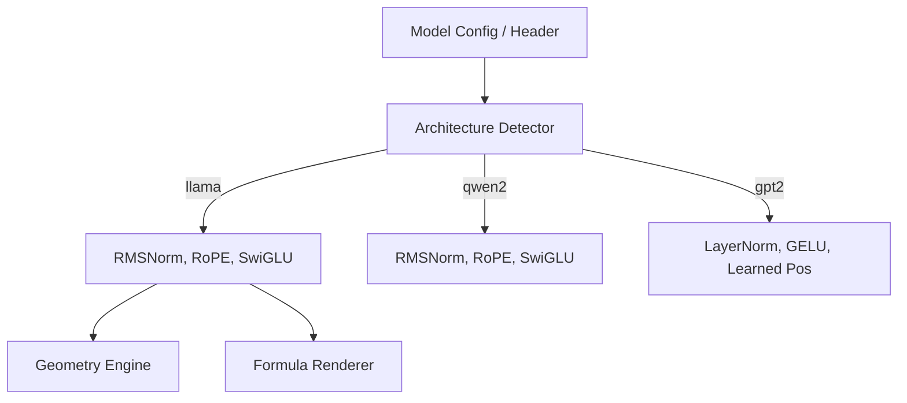

# Supported Models

## Overview

TokenPrint is architecture-aware. It does not just blindly render boxes; it adapts its formulas, 3D geometry, and metadata displays based on the exact architecture of the loaded model.

## Why it matters

Transformers are not a monolith. GPT-2 uses LayerNorm and GELU; Llama uses RMSNorm, SwiGLU, and Rotary Positional Embeddings (RoPE). If a visualization tool renders standard LayerNorm for a Llama model, it is scientifically dishonest.

## How TokenPrint implements it

TokenPrint detects the model family directly from the PyTorch `config.architectures` array or the GGUF header's `general.architecture` key.

Once the architecture is identified, TokenPrint:
1. Selects the correct LaTeX formula set from `lib/formulas.ts`.
2. Adapts the `TransformerStack` geometry (e.g., merging the gate and up projections for SwiGLU, or clustering attention blades based on the real `num_kv_heads` to show GQA).

## Supported Architectures

The following architectures have explicit geometry and formula mappings in TokenPrint:

- **[Llama](Supported-Models-Llama)** (and Llama 2 / Llama 3)
- **[Qwen](Supported-Models-Qwen)** (specifically Qwen 2 / 2.5)
- **[Gemma](Supported-Models-Gemma)**
- **[Phi](Supported-Models-Phi)** (Phi-2 / Phi-3)
- **[DeepSeek](Supported-Models-DeepSeek)**
- *Legacy/Fallback:* GPT-2 / GPT-NeoX

## Model Formats

TokenPrint supports two primary ways of loading models:
- **[HuggingFace (Backend)](Supported-Models-HuggingFace):** Used for Live Inference and trace generation via the PyTorch backend.
- **[GGUF (Frontend)](Supported-Models-GGUF):** Used for static Architecture Exploration and tensor inspection entirely in the browser.

## Diagram

## Related pages
- [Architecture Explorer](User-Guide-Architecture-Explorer)
- [GGUF Format](Supported-Models-GGUF)

## Further reading
- [Project README](../README.md)

## Navigation
| Previous | Home | Next |
| --- | --- | --- |
| [Scene Navigation](User-Guide-Scene-Navigation) | [Home](Home) | [GGUF](Supported-Models-GGUF) |
