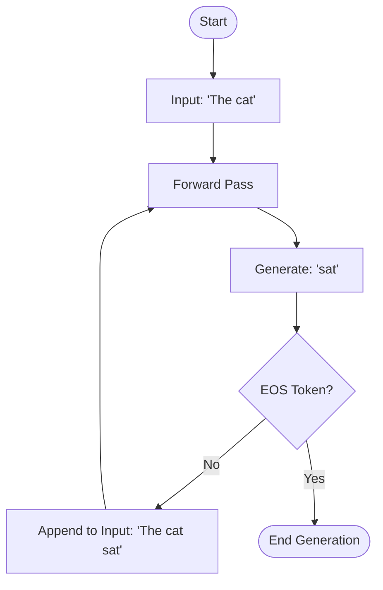

# Autoregressive Generation

## Overview

Autoregressive Generation is the main loop of a language model. "Auto" meaning self, and "regressive" meaning predicting the next step from previous steps. The model predicts one token, appends it to the prompt, and runs the entire forward pass again to predict the *next* token.

## Why it matters

This is why LLMs take time to generate paragraphs. It is a strictly sequential process. You cannot predict the 10th word until you have generated the 9th word. 

## How TokenPrint implements it

The Live Inference mode is a literal visualization of the autoregressive loop.
1. **Prefill:** The first pass through the 3D stack processes the whole prompt at once.
2. **Decode Loop:** Every subsequent pass through the 3D stack represents exactly one loop of the autoregressive engine. The `PlaybackEngine` reaches the top of the stack, logs the chosen token on the Bottom Bar, resets the camera to the bottom, and starts climbing the stack again for the next token.
3. **KV Cache Context:** To prevent the visualization from implying that the model forgets the past, the KV Cache volume grows visually with each loop, proving that past context is retained without needing to be re-run through the whole stack.

## Diagram

## Related pages
- [Live Inference](User-Guide-Live-Inference)
- [KV Cache](Transformer-Concepts-KV-Cache)

## Further reading
- [Architecture Docs](../docs/architecture.md)

## Navigation
| Previous | Home | Next |
| --- | --- | --- |
| [Sampling](Transformer-Concepts-Sampling) | [Home](Home) | None |
