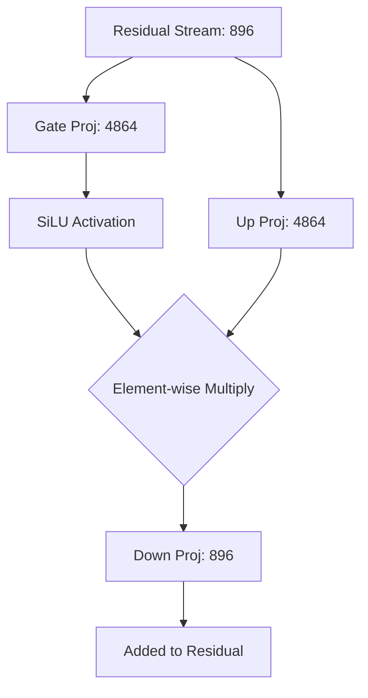

# Feed Forward Network (MLP)

## Overview

After tokens communicate with each other in the Attention layer, they process that new information individually in the Feed Forward Network (often called the MLP - Multi-Layer Perceptron). 

## Why it matters

If Attention is how words *talk* to each other, the MLP is where words *think* about what was said. The MLP is where the model stores the vast majority of its memorized facts and world knowledge. 

## How TokenPrint implements it

The MLP always projects the data into a much wider dimension (the `ffn_size`) before shrinking it back down.
1. **Geometry:** TokenPrint renders the MLP as a massive **Funnel**. The belly of the funnel is sized proportionally to the real `ffn_size / hidden_size` ratio (e.g., 5.4x wider in Qwen 2.5 0.5B).
2. **SwiGLU Architecture:** Modern models don't use a simple linear-activation-linear MLP. They use SwiGLU. TokenPrint explicitly renders this by splitting the input into two prongs (`gate_proj` and `up_proj`), applying the SiLU activation to the gate, and visually merging them at an element-wise multiplication node before passing them to the `down_proj`.

## Diagram

## Related pages
- [LayerNorm](Transformer-Concepts-LayerNorm)
- [Multi-Head Attention](Transformer-Concepts-Multi-Head-Attention)

## Further reading
- [Llama Architecture Paper](Research-Related-Papers)

## Navigation
| Previous | Home | Next |
| --- | --- | --- |
| [LayerNorm](Transformer-Concepts-LayerNorm) | [Home](Home) | [Residual Connections](Transformer-Concepts-Residual-Connections) |
