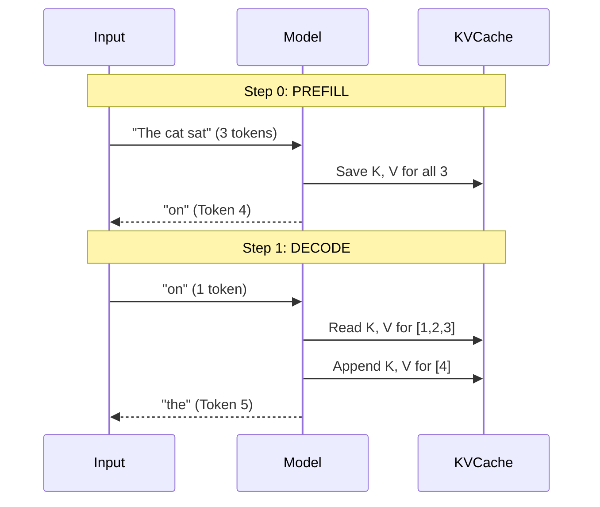

# KV Cache

## Overview

The KV Cache (Key-Value Cache) is an engineering optimization that makes autoregressive generation practical. Instead of recomputing the Keys and Values for every previous token at every single generation step, the model saves them in memory (the cache).

## Why it matters

Without a KV cache, generating the 100th token would take 100 times longer than generating the 1st token, leading to quadratic slowdowns. Understanding the KV cache is essential for inference engineers dealing with memory limits and batch sizing.

## How TokenPrint implements it

TokenPrint explicitly visualizes the state of the KV cache during Live Inference:

1. **The Phase Readout:** The Bottom Bar shows exactly what phase the cache is in.
   - **Prefill:** Step 0. The model processes the entire prompt in parallel. `cache_len = 0`.
   - **Decode:** Step 1+. The model processes 1 token and appends its K and V to the cache. `cache_len = prompt_len + steps`.
2. **Visual Cache Volume:** When active, the 3D UI displays the KV cache as a spatial block alongside the Transformer Stack. During Prefill, you see a wide band of computation. During Decode, you see a single narrow slice of computation alongside a growing, dimmer block of cached memory.

> **Note**
> TokenPrint relies on the backend `model.py` actively threading the PyTorch `past_key_values` object to determine these states. It is a reflection of real backend behavior, not a hardcoded frontend assumption.

## Diagram

## Related pages
- [Multi-Head Attention](Transformer-Concepts-Multi-Head-Attention)
- [Autoregressive Generation](Transformer-Concepts-Autoregressive-Generation)

## Further reading
- [API Reference - WebSocket Events](API-Reference-WebSocket-Events)

## Navigation
| Previous | Home | Next |
| --- | --- | --- |
| [Multi-Head Attention](Transformer-Concepts-Multi-Head-Attention) | [Home](Home) | [LayerNorm](Transformer-Concepts-LayerNorm) |
