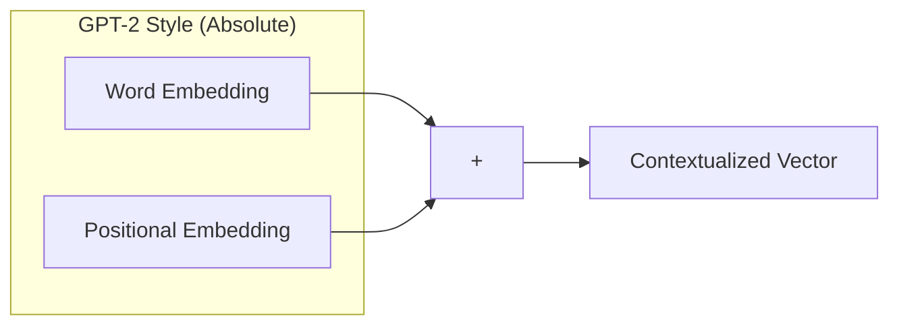

# Positional Encoding

## Overview

Because transformers process all tokens simultaneously (in parallel), they inherently have no concept of word order. "The cat chased the dog" and "The dog chased the cat" look identical to the Attention mechanism. Positional Encoding solves this by injecting spatial information into the embeddings.

## Why it matters

Without positional encoding, language models would be bags-of-words classifiers. They wouldn't understand syntax, grammar, or causality.

## How TokenPrint implements it

There are two main types of positional encoding:
1. **Absolute (Learned/Sinusoidal):** Found in GPT-2. A separate embedding vector is looked up based purely on the token's index (0, 1, 2) and added to the word embedding.
2. **Relative (RoPE):** Found in modern models (Llama, Qwen). Applied *during* attention rather than at the embedding layer.

When TokenPrint detects an older model like `gpt2`, the HUD displays the formula for Absolute Positional Embeddings:
$$h_0 = U W_e + W_p$$
Where $W_p$ is the positional embedding matrix.

For modern models, TokenPrint ignores absolute embeddings and instead highlights **RoPE** during the Attention phase.

## Diagram

## Related pages
- [Embeddings](Transformer-Concepts-Embeddings)
- [RoPE](Transformer-Concepts-RoPE)

## Further reading
- [Transformer Architecture Papers](Research-Related-Papers)

## Navigation
| Previous | Home | Next |
| --- | --- | --- |
| [Embeddings](Transformer-Concepts-Embeddings) | [Home](Home) | [RoPE](Transformer-Concepts-RoPE) |
