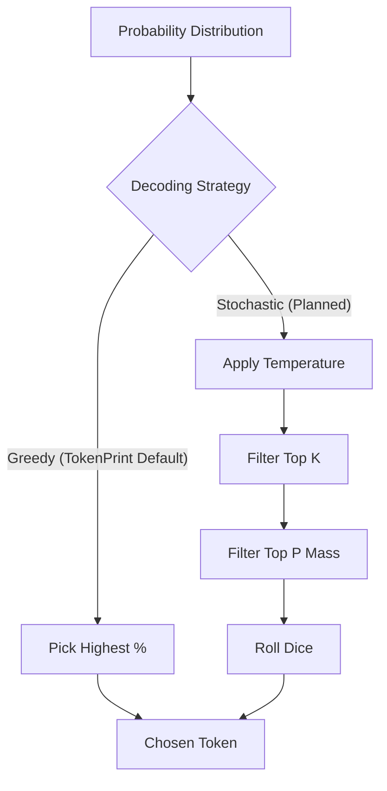

# Sampling

## Overview

Sampling is the process of choosing the *actual* next token from the probability distribution generated by the Softmax function.

## Why it matters

If you always pick the token with the highest probability (Greedy Decoding), the model's output will be deterministic, safe, and often boring or repetitive. By introducing randomness (Temperature, Top-P, Top-K), you allow the model to be creative.

## How TokenPrint implements it

> **Warning**
> **Current Status:** TokenPrint currently enforces **Greedy Decoding** on the backend. 
> `token = torch.argmax(logits, dim=-1)`

Because TokenPrint is an educational and debugging tool, determinism is currently favored over creativity. When you type a prompt, you will see exactly how the model determines the #1 most mathematically likely token. 

The `WS /ws/generate` backend endpoint does calculate `top_k` probabilities to render the Skyline in the UI, but it does not use them to sample stochastically. The `SamplingPlayground` is currently scheduled for an upcoming milestone in the [Roadmap](Roadmap).

## Diagram

## Related pages
- [Softmax](Transformer-Concepts-Softmax)
- [Autoregressive Generation](Transformer-Concepts-Autoregressive-Generation)

## Further reading
- [Roadmap](../ROADMAP.md)

## Navigation
| Previous | Home | Next |
| --- | --- | --- |
| [Softmax](Transformer-Concepts-Softmax) | [Home](Home) | [Autoregressive Generation](Transformer-Concepts-Autoregressive-Generation) |
