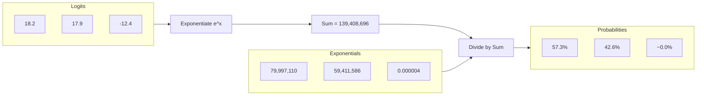

# Softmax

## Overview

Softmax is a mathematical function that takes an array of raw numbers (Logits) and squashes them into a probability distribution where every value is between $0.0$ and $1.0$, and all values sum exactly to $1.0$.

## Why it matters

To generate text, we need to know the *percentage likelihood* of each token being the correct next word. Softmax provides this. Because it uses exponentiation ($e^x$), it heavily amplifies the differences between the highest logits, turning a "slightly better" score into a "much higher" probability.

## How TokenPrint implements it

In the Live Inference scene, TokenPrint renders the result of the Softmax operation at the very top of the `TransformerStack` as the **Top-k Skyline**.

1. **Skyline Geometry:** A row of 3D bars.
2. **Data-Driven Height:** The height of each bar is strictly tied to its real Softmax `prob` value from the backend stream.
3. **Data-Driven Brightness:** To emphasize the exponential nature of Softmax, the brightness/emission of the bar also scales with its probability. The chosen token shines brightly, while the 5th-ranked token is dim.

TokenPrint also uses Softmax heavily in the Walkthrough's **Attention** chapter, showing how attention scores are squashed into weights that sum to 1.0.

## Diagram

## Related pages
- [Logits](Transformer-Concepts-Logits)
- [Sampling](Transformer-Concepts-Sampling)

## Further reading
- [Visual Mapping](../docs/visual-mapping.md)

## Navigation
| Previous | Home | Next |
| --- | --- | --- |
| [Logits](Transformer-Concepts-Logits) | [Home](Home) | [Sampling](Transformer-Concepts-Sampling) |
