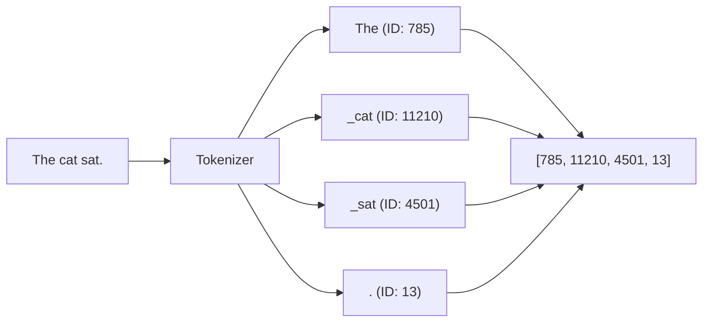

# Tokenization

## Overview

Tokenization is the very first step in any language model. It is the process of breaking down human text into small chunks (tokens) and mapping them to integer IDs from a predefined vocabulary.

## Why it matters

A language model is essentially a massive math equation. Math equations cannot process the letter "A" or the word "Apple". They require numbers. Tokenization translates strings into the numerical language the model understands. The size of the vocabulary directly impacts the size of the Embedding and Unembedding layers.

## How TokenPrint implements it

In TokenPrint, tokenization happens on the backend. When you submit a prompt via `POST /analyze` or `WS /ws/generate`:
1. The backend uses the HuggingFace `AutoTokenizer` associated with the model.
2. It breaks the text down and returns the array of `tokens` alongside their integer `id` and string `text`.
3. In the UI, the **Token Strip** (Bottom Bar) displays these tokens. 
4. In Walkthrough mode, the Tokenization chapter shows a 3D grid visualizing the sequence of integer IDs being fed into the model.

> **Tip**
> Try typing emojis or non-English characters in the prompt. You will see them get broken down into multiple "byte fallback" tokens, which look like `<0xE2>`. TokenPrint's UI highlights these clearly.

## Diagram

## Related pages
- [Embeddings](Transformer-Concepts-Embeddings)
- [Transformer Concepts](Transformer-Concepts)

## Further reading
- [API Reference - Data Models](API-Reference-Data-Models)

## Navigation
| Previous | Home | Next |
| --- | --- | --- |
| [Transformer Concepts](Transformer-Concepts) | [Home](Home) | [Embeddings](Transformer-Concepts-Embeddings) |
