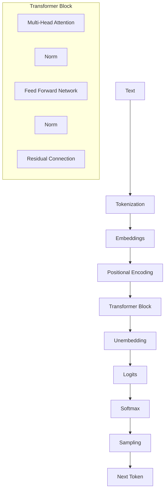

# Transformer Concepts

## Overview

This section bridges the gap between deep learning theory and TokenPrint's visualizations. It provides a beginner-friendly yet technically accurate explanation of every major component in a modern Transformer, alongside how TokenPrint brings that concept to life.

## Why it matters

You cannot fully utilize TokenPrint as a visual debugger without understanding the underlying math and architecture. If you don't know what a KV Cache is, seeing it shrink and grow in the 3D scene won't mean anything to you.

## How TokenPrint implements it

TokenPrint takes abstract mathematical concepts (like dot products and element-wise additions) and maps them to concrete geometric properties:
- Vectors become Points.
- Operations become Distinct Sub-meshes.
- Tensors become Bounding Boxes.
- Magnitudes dictate Colors and Scales.

By reading through these concepts while stepping through the `Walkthrough` mode in the app, you will build a robust, intuitive understanding of language models.

## Section Contents

- **[Tokenization](Transformer-Concepts-Tokenization):** How text becomes numbers.
- **[Embeddings](Transformer-Concepts-Embeddings):** How numbers become high-dimensional vectors.
- **[Positional Encoding](Transformer-Concepts-Positional-Encoding):** Giving the model a sense of order.
- **[RoPE](Transformer-Concepts-RoPE):** Rotary Positional Embeddings (used in Llama/Qwen).
- **[Multi-Head Attention](Transformer-Concepts-Multi-Head-Attention):** How tokens communicate.
- **[KV Cache](Transformer-Concepts-KV-Cache):** The memory system that makes generation fast.
- **[LayerNorm](Transformer-Concepts-LayerNorm):** Keeping activations stable (including RMSNorm).
- **[Feed Forward Network](Transformer-Concepts-Feed-Forward-Network):** Where the model "thinks" (including SwiGLU).
- **[Residual Connections](Transformer-Concepts-Residual-Connections):** The main highway through the model.
- **[Logits](Transformer-Concepts-Logits):** Raw output scores.
- **[Softmax](Transformer-Concepts-Softmax):** Converting scores to probabilities.
- **[Sampling](Transformer-Concepts-Sampling):** Picking the next word.
- **[Autoregressive Generation](Transformer-Concepts-Autoregressive-Generation):** The loop that generates text.

## Diagram

## Related pages
- [User Guide](User-Guide)

## Further reading
- [Visual Mapping](../docs/visual-mapping.md)

## Navigation
| Previous | Home | Next |
| --- | --- | --- |
| [Scene Navigation](User-Guide-Scene-Navigation) | [Home](Home) | [Tokenization](Transformer-Concepts-Tokenization) |
