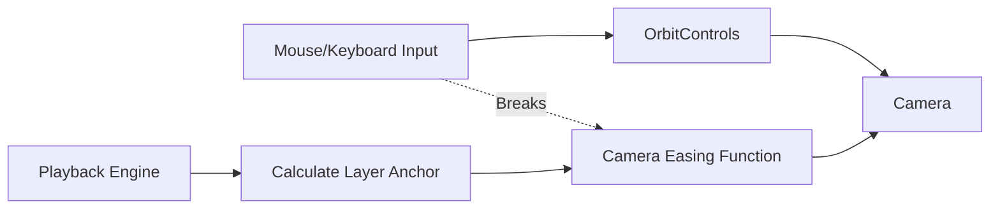

# Camera Controls

## Overview

The 3D Canvas in TokenPrint uses an Orbiting Camera system to let you explore the model geometry from any angle, combined with an automated Follow Camera during live execution.

## Why it matters

Transformer stacks are deep. A static 2D view cannot adequately display the internal structures of a 24-layer model. Giving the user full spatial control ensures no operation is hidden.

## How TokenPrint implements it

TokenPrint relies on React Three Fiber and `OrbitControls`. 
However, during Live Inference or Walkthrough mode, TokenPrint engages a cinematic **Follow Camera** that smoothly eases between active layers to ensure the current computation is always in frame.

## Mouse Controls

- **Left Click & Drag:** Orbit (rotate) around the current target.
- **Right Click & Drag:** Pan (move the target up/down/left/right).
- **Scroll Wheel:** Zoom in and out.

## Keyboard Shortcuts

- **`F11`**: Toggle Fullscreen canvas.
- **`F10`**: Toggle Developer Data / LOD (Level of Detail).
- **`Spacebar`**: Play / Pause the Live Inference timeline.
- **`J` / `K`**: Step Backward / Forward one operation in the timeline.

## Follow Mode

During a generation trace:
1. The `PlaybackEngine` determines the active layer.
2. The Camera system automatically calculates the 3D anchor point for that layer.
3. The camera smoothly glides to the new anchor point.
4. **Overriding:** If you click and drag to orbit, you break the follow mode. A "Recenter" button will appear in the HUD to re-engage automatic following.

## Diagram

## Related pages
- [HUD](User-Guide-HUD)
- [Scene Navigation](User-Guide-Scene-Navigation)

## Further reading
- [Source Code: lib/useKeyboard.ts](https://github.com/Sudharsanselvaraj/Token-Print/blob/main/frontend/lib/useKeyboard.ts)

## Navigation
| Previous | Home | Next |
| --- | --- | --- |
| [Tensor Inspector](User-Guide-Tensor-Inspector) | [Home](Home) | [HUD](User-Guide-HUD) |
