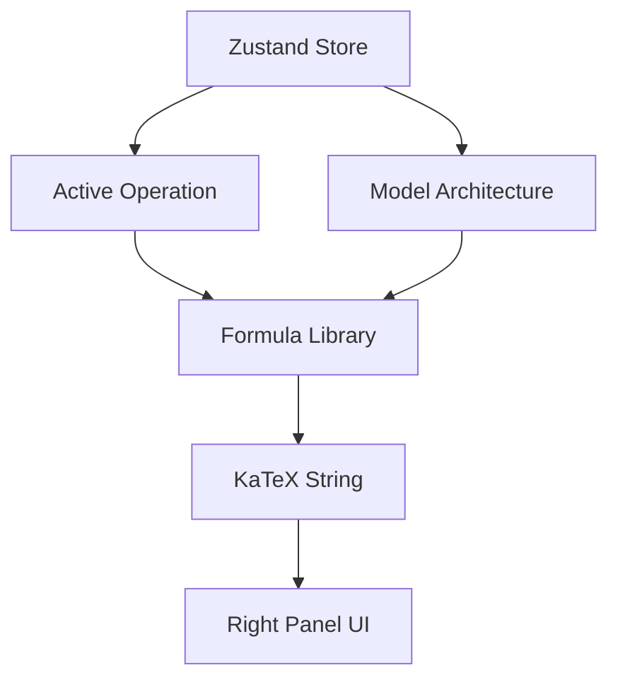

# HUD (Heads-Up Display)

## Overview

The HUD comprises the graphical elements overlaid around the 3D canvas that provide context about the current scene, including live metrics and architectural formulas.

## Why it matters

Without context, 3D shapes are just abstract art. The HUD grounds the visual geometry in mathematical reality by displaying exact parameter counts, probabilities, and the LaTeX formulas governing the active operation.

## How TokenPrint implements it

The HUD is built with standard HTML/CSS placed inside the `AppShell` grid, positioned over the canvas via Z-index where necessary. It uses KaTeX to render high-quality math formulas fetched from `lib/formulas.ts`.

## Key HUD Elements

### 1. The Right Panel (Context Inspector)
- **Mathematical Formula:** Automatically displays the architecture-aware equation for the active component. For example, if a Llama model hits an MLP block, it displays the SwiGLU formula. If GPT-2 hits an MLP, it displays standard GELU.
- **Component Stats:** Shows the parameter count for the specific component currently highlighted in 3D.

### 2. Live Stats (Top Bar)
- Displays global information such as the loaded model name, execution device (`mps`/`cuda`), and total layers.

### 3. KV Phase Readout (Bottom Bar)
- Indicates whether the current step is a **Prefill** (processing the prompt) or a **Decode** (generating a new token).
- Shows `n_positions` (tokens computed this step) and `cache_len` (cached tokens reused).

### 4. Logit Lens
- A persistent panel showing the Top-1 token prediction at every intermediate layer, revealing how the model "makes up its mind" before the final softmax.

## Diagram

## Related pages
- [Timeline](User-Guide-Timeline)
- [Live Inference](User-Guide-Live-Inference)

## Further reading
- [Visual Mapping](../docs/visual-mapping.md)

## Navigation
| Previous | Home | Next |
| --- | --- | --- |
| [Camera Controls](User-Guide-Camera-Controls) | [Home](Home) | [Timeline](User-Guide-Timeline) |
