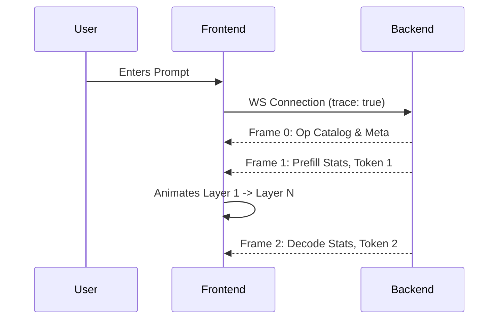

# Live Inference

## Overview

Live Inference is the dynamic execution mode of TokenPrint. It streams a real greedy generation process token-by-token and visualizes the mathematical operations as geometric shapes in the 3D canvas.

## Why it matters

Seeing the data flow through a Transformer Layer demystifies LLMs. Instead of a "black box" that magically outputs text, Live Inference shows the sequential, layer-by-layer computation, revealing how probabilities shift and how the KV Cache grows.

## How TokenPrint implements it

When you enter a prompt and start generation, TokenPrint opens a WebSocket connection (`WS /ws/generate`) to the PyTorch backend. 
1. The backend responds with an `op_catalog` defining all operations.
2. It then streams frames containing the chosen token, top-k probabilities, and per-layer activation statistics.
3. The frontend's `PlaybackEngine` normalizes this stream and animates the `TransformerStack` scene.

**Geometry represents data:**
- **Attention Blades:** One blade per real query head.
- **SwiGLU Funnel:** Sized according to the real `ffn_size / hidden_size` ratio.
- **Lighting:** Active blocks light up based on their real activation magnitude.

## Features

- **Top-k Skyline:** At the output layer, a skyline renders the top probabilities for the next token. The height and brightness correspond strictly to the real `prob` value.
- **KV Phase Readout:** The UI clearly distinguishes between the initial **prefill** phase (processing the whole prompt) and subsequent **decode** steps.
- **Logit Lens Panel:** See what the model *would* predict if you cut the forward pass off at the current intermediate layer.

## Diagram

## Related pages
- [Architecture Explorer](User-Guide-Architecture-Explorer)
- [Timeline](User-Guide-Timeline)

## Further reading
- [Visual Mapping](../docs/visual-mapping.md)

## Navigation
| Previous | Home | Next |
| --- | --- | --- |
| [Architecture Explorer](User-Guide-Architecture-Explorer) | [Home](Home) | [Tensor Inspector](User-Guide-Tensor-Inspector) |
