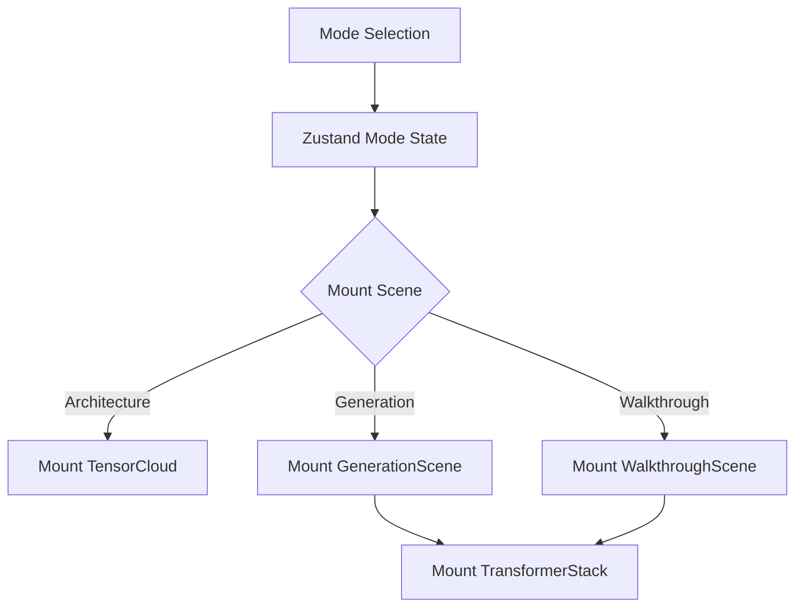

# Scene Navigation

## Overview

Scene Navigation refers to how TokenPrint transitions between different visual modes and how the camera moves between points of interest within those modes.

## Why it matters

A clunky transition between exploring static tensors and watching live inference can break the user's mental model. Smooth scene navigation ensures you maintain spatial awareness of the Transformer Stack.

## How TokenPrint implements it

TokenPrint uses React to mount and unmount different `Scene` components inside the main `AppShell` canvas based on the selected mode in the Top Bar.
- `TensorCloud` for Architecture mode.
- `GenerationScene` for Live Inference.
- `WalkthroughScene` for the guided tour.

Camera navigation is handled by easing functions that interpolate the camera's position and look-at target over time.

## Modes

1. **Architecture:** Free-roam. The camera defaults to an overview of the point cloud.
2. **Generation:** Automated follow-mode. The camera glides down the `TransformerStack` as the `PlaybackEngine` advances through the layers.
3. **Walkthrough:** Chapter-gated. As you click "Next Chapter", the camera glides to specific curated locations (e.g., zooming in on the SwiGLU funnel or the KV Cache).

## Handling Context Loss

If you switch tabs or stress the GPU, WebGL may drop the rendering context. TokenPrint's `SceneLoader.tsx` acts as a safety boundary:
- It probes for WebGL availability.
- It automatically remounts a fresh canvas upon context loss.
- It displays a readable fallback message rather than crashing the browser.

## Diagram

## Related pages
- [Camera Controls](User-Guide-Camera-Controls)
- [Timeline](User-Guide-Timeline)

## Further reading
- [Project README](../README.md)

## Navigation
| Previous | Home | Next |
| --- | --- | --- |
| [Timeline](User-Guide-Timeline) | [Home](Home) | [Transformer Concepts](Transformer-Concepts) |
