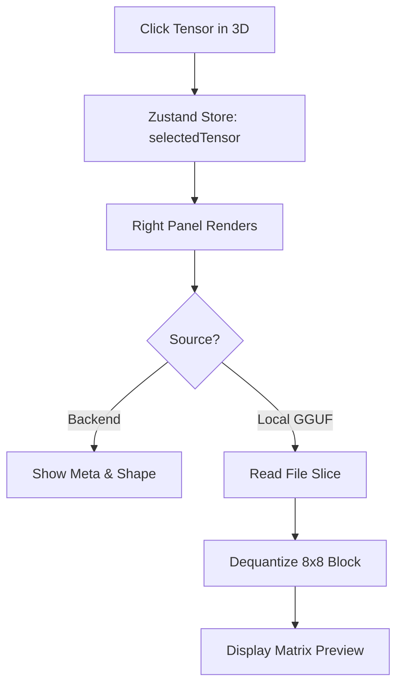

# Tensor Inspector

## Overview

The Tensor Inspector is a dedicated panel that appears when you select a specific tensor from the Architecture Explorer. It provides the exact mathematical dimensions and metadata of the selected weight matrix.

## Why it matters

High-level visualizations are great, but researchers and engineers need exact numbers. Knowing a tensor's shape (`151936, 896`) and data type (`float32` vs `q4_k`) is critical for tasks like model quantization, memory profiling, and manual debugging.

## How TokenPrint implements it

When you click a point in the 3D canvas or select a tile in the Sidebar grid, the `AppShell` passes the `TensorInfo` object to the Right Panel. 

For locally loaded GGUF files, the Tensor Inspector goes a step further by using a client-side dequantizer (`lib/gguf/dequant.ts`) to read and display a small, real 8x8 slice of the actual weights, completely in the browser.

## Using the Inspector

1. Open **Architecture** mode.
2. Click any point in the 3D cloud.
3. Look at the **Right Panel**. You will see:
   - The full tensor path (e.g., `model.layers.0.mlp.gate_proj.weight`).
   - The **Shape** (Rows × Columns).
   - The **Parameter Count** (exact integer).
   - The **DType** (e.g., `float16`).
4. If inspecting a local `.gguf`, you may see a "Weight Preview" table showing the top-left corner of the actual matrix.

> **Warning**
> If you are connected to the live PyTorch backend, you will not see weight previews to save bandwidth. The preview is only available via local GGUF inspection.

## Diagram

## Related pages
- [Architecture Explorer](User-Guide-Architecture-Explorer)
- [GGUF Format](Supported-Models-GGUF)

## Further reading
- [GGUF Parser Details](../docs/gguf-format.md)

## Navigation
| Previous | Home | Next |
| --- | --- | --- |
| [Live Inference](User-Guide-Live-Inference) | [Home](Home) | [Camera Controls](User-Guide-Camera-Controls) |
