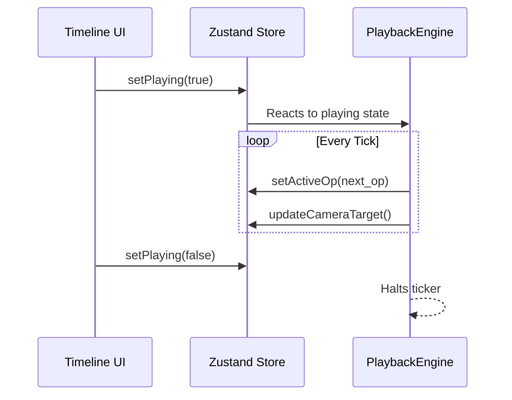

# Timeline

## Overview

The Timeline, located in the Bottom Bar, controls the playback of Live Inference traces and Walkthrough chapters. It allows you to pause, step, and scrub through the model's execution.

## Why it matters

LLM inference happens in milliseconds. To understand it, you must slow it down. The Timeline allows you to decouple the visual playback from the backend computation speed, letting you inspect individual layers and tokens at your own pace.

## How TokenPrint implements it

The `PlaybackEngine` is a headless component running a `setInterval` ticker. 
It walks through the `op_catalog` (the ordered list of operations) layer-by-layer. When the timeline is paused, the ticker stops, freezing the `store.activeOp` state and halting the camera glide.

## Timeline Controls

- **Play/Pause (`Spacebar`):** Toggles autoplay. When paused, the 3D scene freezes exactly on the current operation.
- **Step Back/Forward (`J` / `K`):** Manually advance or reverse one operation (e.g., from Pre-LayerNorm to Self-Attention).
- **Speed Multiplier:** A dropdown (e.g., 0.5x, 1x, 2x) that normalizes the pacing of the autoplay ticker. It does *not* fabricate frames; it simply changes the delay between rendering real operations.
- **Token Strip:** A horizontal list of tokens. The prompt tokens are displayed first, followed by generated tokens. Clicking a token scrubs the timeline to the exact frame that generated it.

> **Note**
> Pacing is strictly normalized. TokenPrint never fabricates in-between frames or synthetic data to smooth out the playback.

## Diagram

## Related pages
- [Live Inference](User-Guide-Live-Inference)
- [Camera Controls](User-Guide-Camera-Controls)

## Further reading
- [Architecture Docs](../docs/architecture.md)

## Navigation
| Previous | Home | Next |
| --- | --- | --- |
| [HUD](User-Guide-HUD) | [Home](Home) | [Scene Navigation](User-Guide-Scene-Navigation) |
