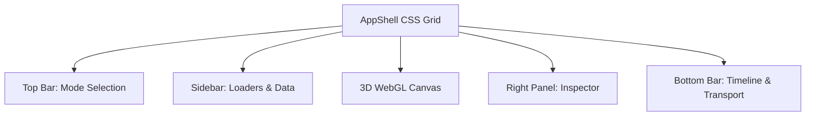

# User Guide

## Overview

The TokenPrint User Guide covers the primary interface elements and interaction modes of the application. TokenPrint is divided into several workspaces, each designed for a specific analytical task.

## Why it matters

Because TokenPrint displays real, untempered data, the interface can be overwhelming at first glance. Understanding how to navigate the 3D scene, inspect tensors, and control playback is essential for making sense of the model's internals.

## How TokenPrint implements it

TokenPrint utilizes a **docked shell** architecture (a CSS grid) to avoid floating, overlapping windows. 
- The **Top Bar** controls global modes.
- The **Sidebar** houses loaders and data panels.
- The **Right Panel** contains context-sensitive inspectors.
- The **Bottom Bar** handles timeline transport and playback.

This clean separation ensures the 3D canvas remains unobstructed while you inspect data.

## Diagram

## Section Contents

- **[Architecture Explorer](User-Guide-Architecture-Explorer):** Inspect static model structures and weight distributions.
- **[Live Inference](User-Guide-Live-Inference):** Watch real-time generation and token probabilities.
- **[Tensor Inspector](User-Guide-Tensor-Inspector):** Dive deep into individual tensor shapes and parameter counts.
- **[Camera Controls](User-Guide-Camera-Controls):** Learn how to orbit, pan, and follow the execution stack.
- **[HUD](User-Guide-HUD):** Understand the on-screen overlays and readouts.
- **[Timeline](User-Guide-Timeline):** Control playback speed, pause, and step through layers.
- **[Scene Navigation](User-Guide-Scene-Navigation):** Quickly jump between chapters and components.

## Related pages
- [Getting Started](Getting-Started)
- [Architecture Explorer](User-Guide-Architecture-Explorer)

## Further reading
- [Project README](../README.md)

## Navigation
| Previous | Home | Next |
| --- | --- | --- |
| [Running your first visualization](Getting-Started-Running-your-first-visualization) | [Home](Home) | [Architecture Explorer](User-Guide-Architecture-Explorer) |
