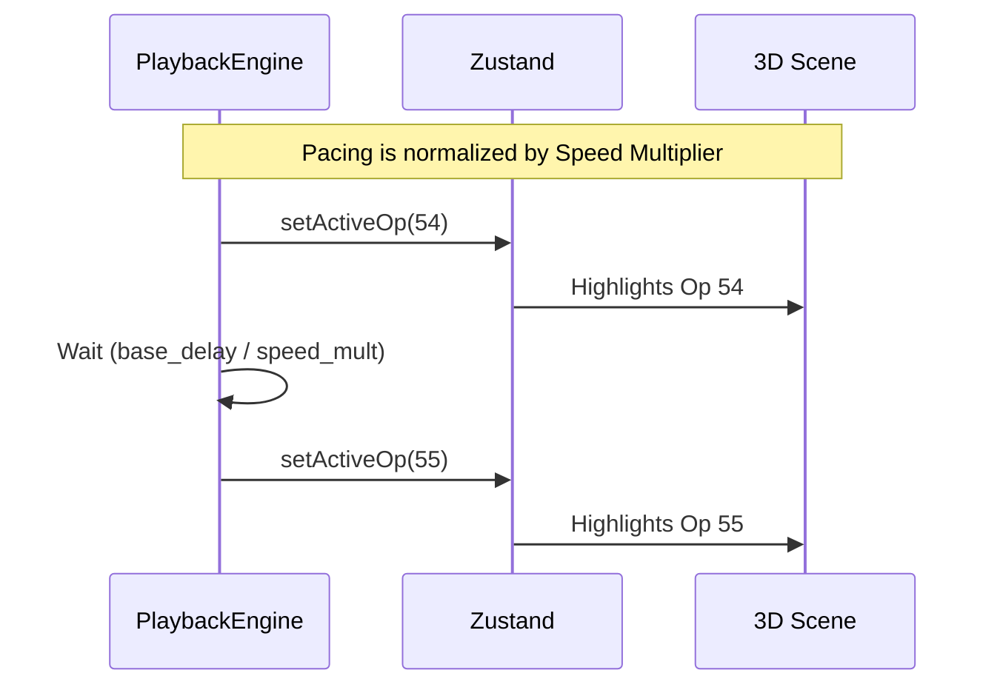

# Animation System

## Overview

The Animation System in TokenPrint refers strictly to the temporal pacing of the visualization. It governs how the playback ticker advances through the operation trace.

## Why it matters

The core promise of TokenPrint is "Real data only." If the animation system artificially interpolates or guesses intermediate states to make a transition look smoother, it breaks that promise. 

## How TokenPrint implements it

TokenPrint uses a single, headless `PlaybackEngine` component. 

### The Ticker Rule
The ticker runs on a `setInterval` or `requestAnimationFrame` loop. However, **it never fabricates frames**. 
- It looks at the `op_catalog` (e.g., 243 operations).
- Based on the user's Speed Multiplier, it waits $X$ milliseconds.
- It then instantly updates the `store.activeOp` to the next index.
- The Geometry and Materials react instantly to the new `activeOp`.

### Idle Animation
To keep the 3D scene from feeling sterile when paused, TokenPrint applies a very slight, slow sine-wave rotation to certain elements. This is strictly visual polish and is carefully designed to be unmistakable from actual computational updates.

## Diagram

## Related pages
- [Timeline](User-Guide-Timeline)
- [Camera System](Visualization-System-Camera-System)

## Further reading
- [Playback Architecture](../docs/architecture.md)

## Navigation
| Previous | Home | Next |
| --- | --- | --- |
| [Materials](Visualization-System-Materials) | [Home](Home) | [Color Mapping](Visualization-System-Color-Mapping) |
