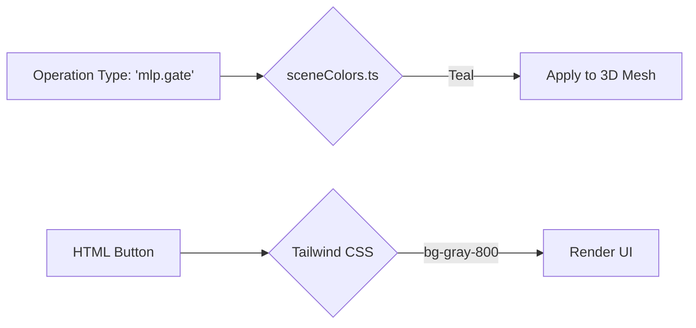

# Color Mapping

## Overview

Color Mapping defines how TokenPrint uses hue, saturation, and brightness to convey meaning. The application adheres to a strict monochromatic UI, saving bright colors exclusively for the 3D data visualizations.

## Why it matters

If colors are applied arbitrarily, the user is forced to guess what they mean. By establishing a rigid color-coding system (e.g., Attention is always Blue, MLP is always Green), users can instantly visually parse a massive transformer stack without reading labels.

## How TokenPrint implements it

All canonical colors are defined in a single source of truth: `lib/sceneColors.ts`.

### Component Color Classes
- **Attention (Q/K/V/O):** Shades of Blue
- **MLP (Gate/Up/Down):** Shades of Green / Teal
- **LayerNorm (RMSNorm):** Warm Yellow / Orange
- **Embed / Unembed:** Purple
- **Residual Stream:** Neutral Gray

### Rules
1. **No UI Contamination:** The React panels, buttons, and text are strictly black, white, or gray. 
2. **Brightness = Magnitude:** The brightness of a color (its emission) is reserved for data magnitude. A brighter blue attention blade means a higher activation strength for that layer.
3. **Probability = Grayscale:** In the Top-k Skyline, probability is not colored; it is represented by the physical height and grayscale emission of the bar.

## Diagram

## Related pages
- [Materials](Visualization-System-Materials)
- [Visual Mapping](../docs/visual-mapping.md)

## Further reading
- [Source Code: lib/sceneColors.ts](https://github.com/Sudharsanselvaraj/Token-Print/blob/main/frontend/lib/sceneColors.ts)

## Navigation
| Previous | Home | Next |
| --- | --- | --- |
| [Animation System](Visualization-System-Animation-System) | [Home](Home) | [Camera System](Visualization-System-Camera-System) |
