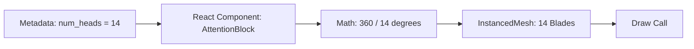

# Geometry

## Overview

Geometry refers to the actual 3D shapes (vertices, edges, faces) drawn in the canvas. In TokenPrint, geometry is entirely data-driven.

## Why it matters

If you draw a generic box and label it "MLP," you are making an illustration. If you draw a funnel whose volume is strictly proportional to `ffn_size / hidden_size`, you are making an instrument. TokenPrint is an instrument.

## How TokenPrint implements it

TokenPrint maps specific tensor properties directly to geometric parameters in Three.js primitives (like `CylinderGeometry`, `BoxGeometry`, or custom shapes).

### The Generation Stack Contract

| Component | Geometry Source | Formula |
| --------- | --------------- | ------- |
| **Attention Blades** | Query Heads | Count = `num_heads`, Grouping = `num_kv_heads` |
| **MLP Funnel** | FFN Ratio | Radius = `ffn_size / hidden_size` |
| **LayerNorm** | Scaling factor | Rendered as a pinched waist |
| **Residual Stream** | Layer count | A continuous spine through the stack |

### The Point Cloud Contract

In the Architecture Explorer, the `TensorCloud` does not use instanced meshes. It uses a single `THREE.Points` object.
- The **Density** of points in a cluster is calculated directly from the tensor's `n_params`.
- The parser builds a single `BufferGeometry`, enabling smooth 60fps rendering of millions of points on integrated GPUs.

## Diagram

## Related pages
- [Materials](Visualization-System-Materials)
- [Visual Mapping](../docs/visual-mapping.md)

## Further reading
- [Visual Mapping Docs](../docs/visual-mapping.md)

## Navigation
| Previous | Home | Next |
| --- | --- | --- |
| [Scene Graph](Visualization-System-Scene-Graph) | [Home](Home) | [Materials](Visualization-System-Materials) |
