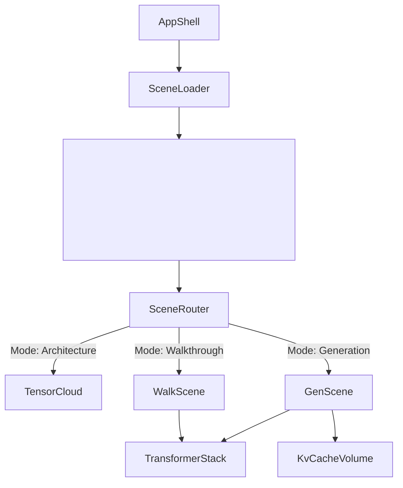

# Scene Graph

## Overview

The Scene Graph is the hierarchical tree of React components that dictates exactly what is rendered inside the React Three Fiber `<Canvas>`.

## Why it matters

In declarative 3D (like R3F), the structure of the React tree directly mirrors the structure of the WebGL scene. A well-organized scene graph ensures that when the user switches from Architecture Explorer to Live Inference, memory is properly garbage collected and the scene is rebuilt deterministically.

## How TokenPrint implements it

TokenPrint uses `components/SceneLoader.tsx` as the primary boundary. Inside it, a single `Scene` component listens to the `mode` state in the Zustand store and mounts one of three main sub-scenes:

1. **`TensorCloud.tsx`**: A single highly optimized `THREE.Points` mesh.
2. **`GenerationScene.tsx`**: A complex hierarchy containing the `TransformerStack`, `KvCacheVolume`, and `Skyline`.
3. **`WalkthroughScene.tsx`**: A wrapper around `TransformerStack` that controls chapter-specific highlighting and camera angles.

### Shared Components
Components like the `TransformerStack` are reused across modes to ensure visual consistency. If a SwiGLU funnel is updated for Generation, it automatically updates for the Walkthrough.

## Diagram

## Related pages
- [Geometry](Visualization-System-Geometry)
- [Scene Navigation](User-Guide-Scene-Navigation)

## Further reading
- [Frontend Architecture Docs](../docs/architecture.md)

## Navigation
| Previous | Home | Next |
| --- | --- | --- |
| [Visualization System](Visualization-System) | [Home](Home) | [Geometry](Visualization-System-Geometry) |
