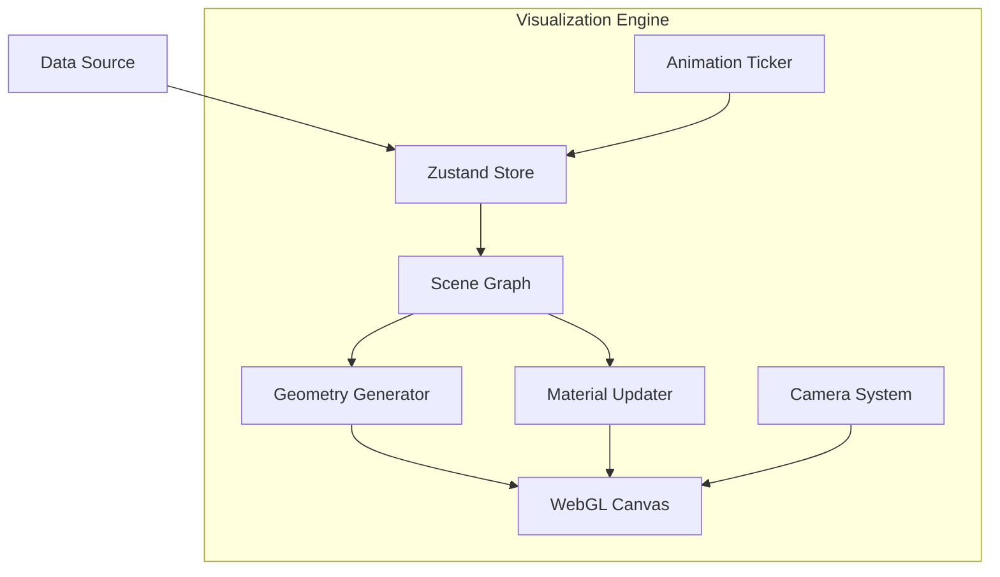

# Visualization System

## Overview

TokenPrint's Visualization System is built on React Three Fiber (R3F) and Three.js. It is responsible for translating the raw, numeric output of a language model into an interactive, 60fps 3D environment in the browser.

## Why it matters

Translating abstract mathematics into geometry requires rigorous discipline. If the visualization system uses arbitrary placeholder shapes, it stops being an educational tool and becomes mere decoration. The architecture of the rendering engine must guarantee a strict 1-to-1 mapping between data and visuals.

## How TokenPrint implements it

The rendering pipeline is split into explicit sub-components that manage different aspects of the 3D scene:
- **[Scene Graph](Visualization-System-Scene-Graph):** The hierarchy of React components that dictates what is rendered based on the active mode.
- **[Geometry](Visualization-System-Geometry):** The data-driven shapes (blades, funnels, waists) that build the Transformer Stack.
- **[Materials](Visualization-System-Materials):** How light and color interact with the geometry to convey activation strength.
- **[Animation System](Visualization-System-Animation-System):** The headless ticker that drives playback pacing without fabricating frames.
- **[Color Mapping](Visualization-System-Color-Mapping):** The strict, monochrome-plus-accent ruleset for assigning meaning to hues.
- **[Camera System](Visualization-System-Camera-System):** The logic governing the cinematic follow-camera and orbit controls.
- **[Interaction Model](Visualization-System-Interaction-Model):** How mouse hovers and clicks map from 3D space back to tensor data.

## Diagram

## Related pages
- [Architecture Explorer](User-Guide-Architecture-Explorer)
- [Architecture](Architecture)

## Further reading
- [Visual Mapping Docs](../docs/visual-mapping.md)

## Navigation
| Previous | Home | Next |
| --- | --- | --- |
| [Supported Models](Supported-Models) | [Home](Home) | [Scene Graph](Visualization-System-Scene-Graph) |
